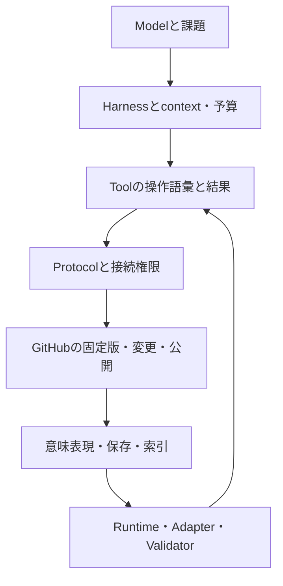

# AKR Architecture Search-Space Coverage Audit

Artifact ID: AKR-ANALYSIS-20260929-COVERAGE-01  
依頼日: 2026-09-29 / 調査・統合: 2026-09-29〜30（JST）  
状態: 探索監査・設計仮説。Architecture、形式、schemaの採用決定ではない。

## 0. 結論と監査の境界

**既存候補集合はArchitecture全体の探索範囲を代表していない。前回のARCH-A/B/Cは、主に意味のauthorityと表現間の同期を広げた候補である。次は形式を追加するより、資産の粒度、変更操作、実行状態、queryとtool公開、配布・保存の選択肢を組み合わせて比較する必要がある。**

本監査では、目的から47の設計上の問いを再導出した。この数は独立変数の数や網羅率を意味しない。強く結合する問い、横断的な能力、比較的独立に変更できる問いを区別し、制約を付けた設計地図として扱う。

主な判断は次のとおり。

1. **意味モデル、encoding、保存先、query、retrieval、実行方式、公開interfaceを別々に選べる状態を保つ。** 形式名の一列比較では判断できない。
2. **候補固有の意味版と、対応不能・未判定を許す。** 薄い共通管理層にも意味があり、全候補共通のsemantic revisionや万能なscope言語を要求すると、そこが新しい固定点になる。
3. **Interface Capacityは保証付きに到達できる課題の範囲として測る。** tool数やbackendの機能一覧では測れない。Realization Efficiencyは、その範囲でのAIの正確さと全工程費用を併記する。
4. **新しいfamilyは実験仮説である。** 実運用datasetが不足しており、現時点でPareto最適や最終winnerを宣言する根拠はない。
5. **登録は最終選定を待たせない。** 保存・候補化・評価・用途別採用を段階化し、原資料と失敗例を将来の再評価に使えるよう残す。

### 0.1 対象資料と時間の固定

| 記号 | 監査した資料 | この監査での役割 |
|---|---|---|
| I | [今回の上流入力](inputs/2026-09-29-search-space-coverage-input.txt)と会話内のPurpose / Principles / Constraints | 要求。候補形式は前提にしない |
| U | [上流設計評価](2026-09-29-upstream-design.md)、PR head `a9c6d88c1af5f2ed04b13937b369b337bd976508`時点 | 最初の導出・比較・推奨の検討範囲 |
| P | [実運用とArchitecture探索の評価](2026-09-29-production-driven-architecture-evaluation.md)、同head時点 | Uからの更新、複数候補・実運用評価の検討範囲 |
| V | [v0.2設計案のdirectory](https://github.com/Authenticationalias/Algorithmic-Knowledge-Runtime/tree/667ecd78b3eb25ae6554f24e24bd079df57bd5c8/docs/architecture) | Synthesis、Reasoning Asset ADR、Capability、Canonical Semantic、Relation、Migrationの6文書。いずれも候補資料 |
| M | [main README](https://github.com/Authenticationalias/Algorithmic-Knowledge-Runtime/blob/3a6af67f70cde6f2b4dfbf3f9a54c157df3b96d8/README.md)、AGENTS、検証workflow等 | 現行運用との境界確認。将来構成の正解を与える資料ではない |

Vの略号は、V-Cap＝CAPABILITY_MODEL_v0.1、V-Sem＝CANONICAL_SEMANTIC_MODEL_v0.1_draft、V-Rel＝RELATION_MODEL_v0.1_draft、V-Mig＝MIGRATION_MAP_v0.1。U/Pの節番号は各文書内の番号である。

これは上記資料に対する監査であり、全過去会話、全実装、全研究分野の網羅調査ではない。「資料中に比較がない」は「実装に機能が存在しない」を意味しない。公式資料に基づく機構の説明、AKRへの転用仮説、この接続での観測を区別する。

調査時点のmainは`3a6af67f70cde6f2b4dfbf3f9a54c157df3b96d8`、候補branchは`667ecd78b3eb25ae6554f24e24bd079df57bd5c8`。本成果はdraft PR #1への分析文書追加であり、既存分析、採用規則、schema、algorithm assetsを変更しない。

### 0.2 Coverageの判定規則

- **探索済み（限定）**: その問いについて複数選択肢、利害、選択が変わる条件が資料にある。本監査の粒度で比較論点が成立しているという意味。
- **部分的**: 要求・一案・一部の代案はあるが、重要な選択肢か結合分析が不足する。
- **未探索**: 名称の言及はあっても、選択肢間の判断を支える分析が対象資料にない。

これと別に実証を、**仕様・宣言の確認 / 限定操作の観測 / 条件固定の比較 / 長期運用**で区別する。今回、新しいfamilyの比較実験・長期運用評価は行っていない。行数や規格数から「何%網羅した」とは算出しない。

## 1. 形式名を使わない必要能力の導出

| 目的から生じる必要能力 | 設計しなければならない問い | 主な次元 |
|---|---|---|
| 会話や実行から有用な方法を残す | 原資料、抽出した方法、推論による補完をどう分けるか | D01〜04、D17 |
| 後から意味を理解する | 何を規範として読み、曖昧さ・矛盾・未知をどう扱うか | D05〜08 |
| 適切な方法を見つける | 何を質問でき、どこで絞り、選べない場合をどう返すか | D24、D28〜31 |
| 再利用・合成する | 型、適用条件、依存、作用、状態、停止をどう接続するか | D09〜14 |
| AIが継続的に変更する | 変更語彙、変更単位、受理条件、履歴は何か | D15〜22、D32 |
| 複数AIが並行管理する | 何を同時に成立させ、どの競合で調整を要求するか | D19〜22、D38〜40 |
| 大量の資産を必要量だけ扱う | 部分取得、分割、配布、生成、失効、予算をどう制御するか | D23〜31、D42、D46 |
| 破損・停止・誤改修から回復する | 何を信頼し、何を再構成し、何が戻せないか | D32〜35、D43、D45 |
| 将来の形式・環境へ移る | 内容・解釈・履歴・採用判断のどれを保存して移すか | D27、D33、D41、D44〜47 |
| 利用実績から改善する | 成功・失敗・未選択をどの構成と結び、比較するか | D36〜37、D47 |

AI-nativeから導くのは「AIが毎回全文を直接編集すること」ではない。構造patch、目的別command、検証器、query、非同期jobをAIが選んで使う構成も含む。人間向け可読性の代わりに、対象特定、変更の局所性、エラーの診断、再試行、移行、復旧の総費用を評価する。

## 2. AKR Design-Dimension Map

### 2.1 独立性の考え方

以下の次元は「別の問いとして代案を比較する価値がある」単位であり、完全な直交軸ではない。独立性は、他の選択を固定してその選択だけを変えられるか、変えた際にどの契約を修正する必要があるかで検討する。

validation、migration、repair、rollback、preservationは複数層にまたがる能力である。それでも、対象・時点・実行位置・失敗時の扱いを選ぶ設計問題があるため、地図から落とさない。scalabilityやmaintainabilityは評価属性であり、ここでは保存方式と同列の選択肢にはしない。

### 2.2 対象、意味、利用

| ID | 独立して問うこと | 主要選択肢（併用可能） |
|---|---|---|
| D01 | Capture / extraction: 何を登録するか | 原資料を保持／抽出候補を生成／既存候補と統合／variantとして保持／対応保留。出典とAIの補完を分ける |
| D02 | 管理対象の種類 | 手続き／制約・規則／評価器／合成recipe／生成器／サービス契約／学習済み方策。すべてを初期対象にする必要はない |
| D03 | 資産の粒度・境界 | 完結した方法／primitive／parameter化template／部分手順／複数資産の集合。保存・版・評価・配布の単位は別に選べる |
| D04 | Identity / sameness | 名目的な系統ID／固定実体の識別／内容による識別／範囲付き意味同値の主張。分割・合流・aliasを明示 |
| D05 | Semantic authority | 単一規範／scope別規範／共同規範／連邦的受理／候補・用途ごとの採用。規範内容と採用判断の権威を区別 |
| D06 | Semantic model / representation | 契約付き文章／型付き木・graph／状態遷移／関係と規則／制約系／実行コード／混成。D02は対象、D06はその記述の構造 |
| D07 | 解釈・不確実性・矛盾 | 不在を偽とする範囲／不在を未知とする範囲／成立・不成立・未判定・矛盾／確率的主張／明示的な例外と撤回。論理と証拠状態を分ける |
| D08 | Applicability | 静的条件／実行前probe／証拠に基づく判定／経験的適合／AI判断。入力、単位、環境、予算、時間範囲を扱う |
| D09 | Dependency | 宣言／推論／実測依存、必須／任意／条件付き／負の依存。登録時・公開時・実行時の解決と固定を選ぶ |
| D10 | Composition | 関数接続／workflow／規則・制約合成／階層分解／template特殊化／生成後検証。型だけでなく作用・状態・停止の整合性を扱う |
| D11 | Execution semantics | 純粋計算／tool作用／対話／反復探索／確率的方策／宣言的解決／遅延評価。実行されない記述資産も許す |
| D12 | 実行状態・作用・失敗 | 単発／永続instance／checkpointとcontinuation、再試行／補償／部分成功／中断終了。定義の版と実行中instanceの版を分ける |
| D13 | Model adaptation | 無適応／能力profileによる選択／分解／例の追加／表現変換／toolへの委任／routing。model名と観測能力を同一視しない |
| D14 | Runtime adaptation | binding／compile／interpret／emulate／外部委任／部分対応／不適合として拒否。実行能力の欠落を文章化で隠さない |

### 2.3 変更、履歴、整合性

| ID | 独立して問うこと | 主要選択肢（併用可能） |
|---|---|---|
| D15 | Revision / compatibility | 資産版／record版／snapshot版／変更集合版。意味版・表現版・評価版と互換性主張を別管理。共通意味版を強制しない |
| D16 | History | 上書き状態＋外部履歴／不変snapshot列／revision DAG／差分列／操作log／eventから状態再構成／混成 |
| D17 | Lineage / provenance | 親・fork・合流／入力・処理・実行者／出典／採用理由／検証証拠。系譜、実行依存、品質保証は別 |
| D18 | Mutation model | 全体置換／構造patch／意味上のcommand／transaction／事実の追記／再生成／制約の解き直し |
| D19 | Synchronization | 一方向伝播／双方向更新／変更提案交換／非同期／要求時／対応版だけ保持。即時同期を全資産に要求しない |
| D20 | Concurrency / consistency | 単一writer／scope別writer／楽観的検出／排他／不変branch／収束可能操作。読取は最新確定状態／固定snapshot／因果整合／期限付き旧版等を別に選ぶ |
| D21 | Transaction boundary | record／資産集合／依存閉包／公開snapshot／複数repository。原子的確定／段階確定／補償。不変条件の範囲と合わせる |
| D22 | Conflict handling | 拒否／隔離／再試行／優先規則／三方向統合／意味検査／矛盾した主張の併存。構造・意味・資源・authority競合を区別 |

### 2.4 保存、検索、提供

| ID | 独立して問うこと | 主要選択肢（併用可能） |
|---|---|---|
| D23 | Storage | 文書／record／関係／graph／object／log。集中／分割／階層化／外部payload。論理モデルと永続化単位を区別 |
| D24 | Addressing / locating | path／安定名／内容address／queryでの特定／複合。発見用の名前と固定版の取得先を分ける |
| D25 | Distribution | 中央取得／複製／連邦／bundle／要求時取得／offline限定利用。接続断・失効情報の遅延を含む |
| D26 | Packaging / release | 単体／依存閉包／用途bundle／環境込み／遅延参照／差分配布。公開集合の整合性と鮮度を別判定 |
| D27 | Serialization / exchange | text／binary、自己記述／外部schema、strict／拡張許容、正規化あり／なし、stream／random access。交換の可逆性も選ぶ |
| D28 | Indexing | 全量走査／語彙／属性／関係／類似／複合。全件・部分・増分・要求時構築 |
| D29 | Query | 固定lookup／parameter化query／組合せ可能query／宣言的query／計画探索／自然言語からのcompile。結果の完全性・説明も契約 |
| D30 | Retrieval / selection | filter／語彙／類似／関係探索／多段取得／再検索。候補生成、ranking、適用判定、no-matchを分離 |
| D31 | Caching | なし／固定版cache／期限／依存連動失効／採用状態別cache／読取時検証。速さだけでなく古い廃止情報の影響を扱う |

### 2.5 保守、interface、継続性

| ID | 独立して問うこと | 主要選択肢（併用可能） |
|---|---|---|
| D32 | Validation | 構造／参照／型・作用／性質／例／差分／統計／独立レビュー。保存・採用・実行前・変更後の検査。未判定を許す |
| D33 | Migration | encoding変換／意味写像／ID対応／履歴移送／読取互換／二重読取／遅延移行／段階切替。完全・部分・拒否を区別 |
| D34 | Repair | 再取得／再生成／再解決／局所修正／意味再評価／隔離／採用撤回。正本自体が疑わしい場合の根拠も必要 |
| D35 | Rollback | 参照切替／逆patch／旧snapshot公開／補正event／外部作用の補償／復元不能の明示 |
| D36 | Observability | operation記録／event／trace／snapshot／sample。保守操作と実利用を結び、欠測・途中停止を記録 |
| D37 | Evaluation | 固定試験／property／differential／metamorphic／実運用観測／paired replay／反例探索。評価対象と評価機構自身を分ける |
| D38 | Interface / tool exposure | 細粒度汎用操作／目的別command／query＋command／batch／plan・検証・確定／artifact参照／非同期job。エラーと回復情報も含む |
| D39 | Access protocol | request-response／stream／message／file・bundle／job handle。再接続、取消、pagination、状態保持の方式を選ぶ |
| D40 | Trust / permissions | 読取／提案／検査／採用／実行／policy変更の権限分離。中央受理／委譲／証拠検証／用途別trust |
| D41 | Archival / preservation | bytes／仕様・reader／実行環境／移行保存／emulation／選択保持。欠落・破損・解釈不能を区別 |
| D42 | Resource scheduling / budget | 同期／queue／優先度／増分処理／checkpoint／費用上限／能力に応じた委任。再生成・再評価集中への対処 |
| D43 | Durability / availability / failure model | 保存だけ継続／旧版で限定利用／複製から復旧／実行停止。GitHub、index、model、reader、採用情報の障害を分ける |
| D44 | Lifecycle / retention | 保存・候補・採用・非推奨・置換・利用停止・保存終了の遷移。資産、表現、validator、runtimeごとに扱う |
| D45 | 外部環境・再現性 | 完全固定／応答記録で再生／環境の部分再現／手順のみ再利用／比較不能。外部tool・model・worldの変動を含む |
| D46 | Derived representations | 決定的／確率的／検証付き生成、事前／要求時生成、生成recipe保持／承認済み出力固定。入力・生成器・環境への依存 |
| D47 | 時間の意味 | 記録時刻／効力発生時刻／観測時刻／採用期間。過去に何を知っていたかと、今その過去をどう評価するかを区別 |

元の35項目はすべて上表に対応する。model adaptationとruntime adaptation、synchronizationとderived representationsを分けたまま、取得、対象・粒度、解釈、作用・状態、serialization、権限、予算、障害、lifecycle、環境、時間を補った。47項目を47必須fieldに変換する提案ではない。

## 3. 次元間の依存と、成立しない組合せ

### 3.1 強い結合と方向性

| 起点となる選択 | 制約される選択 | 検討すべき結合 |
|---|---|---|
| D03 粒度 | D04/09/15/21/26/37 | 何を一つとするかで版、依存密度、評価・更新・配布の単位が変わる |
| D06 意味の構造 | D07/10/11/29/32 | 記述できる性質が、query、合成、実行、検証可能範囲を制約する |
| D05 authority | D18/19/22/40/44 | どの変更を誰が受理すると利用可能な意味が変わるか |
| D18 mutation | D16/20/21/22/34 | 全体置換、command、eventでは競合判定と復旧単位が変わる |
| D20 読取整合性 | D21/25/31 | 一括確定の範囲と、読者がいつどの版集合を見るかは別。分散・cache経路も含めて保証する |
| D09 依存の解決時点 | D14/26/31/45/46 | 実行時依存の更新は固定bundleだけでは再現できない |
| D12 外部作用と状態 | D20/21/35/36/43 | 途中停止、重複実行、補償の意味をcontent rollbackで代用できない |
| D16 履歴の権威 | D33/34/41/47 | eventを再解釈する方式では旧eventと解釈器の保存が必要になる |
| D25 offline利用 | D05/22/31/40/44 | 最新の利用停止情報が見えないときの採用と同期規則が必要 |
| D38 tool公開 | D18/21/29/32/36 | 内部のquery・transaction・検証がAIの操作として利用可能か |
| D46 派生生成 | D09/31/34/42/45 | 生成条件、失効、再生成範囲、処理予算が共同で決まる |

比較的独立に試しやすいのは、同じ意味モデルのencoding変更、固定corpusに対するretrieval変更、同じ操作契約のprotocol変更である。ただし未知fieldの保持、部分取得、転送量、結果切捨て等を通じて実装上は結合する。「意味が同じだから費用も同じ」とは扱わない。

### 3.2 不変条件から候補を絞る例

以下は設計上の反例であり、現行AKRで発生した障害の記録ではない。

- **同じIDを持つ二つの表現を、証拠なしで同じ意味版とする組合せ**は不適切。系統の関連を保持し、同値性は範囲と根拠を持つ別主張にする。
- **独立編集を全面許可し、双方向変換を常に無損失と仮定する組合せ**は成立条件が不足する。変換可能領域、補助情報、競合・拒否条件を定める。
- **禁止cycleを持つ依存graphを、各辺の無条件unionだけで公開する組合せ**は不変条件を壊し得る。A→BとB→Aを別々のAIが追加すると、各局所変更は通っても合併後にcycleができる。
- **外部作用がある手順を、無条件再試行＋Gitの旧版復帰だけで回復する組合せ**は重複作用を防げない。作用先の重複抑止、実行記録、補償等が必要になる。
- **任意に長いoffline利用と、常に最新の廃止・採用状態に従う保証**は同時には満たせない。接続確認、利用期限、限定利用、停止のいずれかを選ぶ。
- **eventを正本としながら、旧解釈器・event意味を保存しない再生方式**は復旧根拠を失う。版付き解釈、移行済みsnapshot等の戦略が必要。
- **意味評価を一つの入出力試験だけで同一性判定する組合せ**は、方法自体、適用範囲、失敗時挙動、費用の差を見落とす。規範とする性質を先に指定する。

### 3.3 探索の単位

全選択肢の直積を実装する必要はない。まず「mutation×transaction×interface」「粒度×依存×合成」「authority×同期×対応判定」「作用×失敗×rollback」のような、結果を大きく変える結合を選ぶ。

一要素ずつ変える比較に加え、二要素の各組合せを揃えた比較で相互作用を調べる。ただし三要素以上の相互作用は別に検討する。個別比較に加え、最適に組み合わせた構成全体の試験を残す。hybridと書くだけで未定義の境界を埋めたことにはしない。

## 4. 設計能力から形式・標準を逆引きする

ここで初めて具体的な形式・製品・標準へ対応付ける。下表は順位表ではない。一つの方式が複数責務を実装する場合も、同じ責務を複数方式で実装する場合もある。

### 4.1 既存候補の役割を整理する

| 方式・標準群 | 主に対応する次元 | 実現に使える能力／別に決めること |
|---|---|---|
| JSON / YAML / XML | D27、schemaを加えてD06/32 | 構造を符号化する。authority、アルゴリズム同一性、公開transactionは別。XMLのschema・変換・query体系もencodingとは分ける |
| Markdown | D06/27 | 規範文章、例、出典を保持できる。機械操作する意味の位置・粒度・解釈契約は追加で必要 |
| JSONL | D27/36、場合によりD16 | record列の転送・観測保存。行の追記だけでは、受理済みeventの意味やevent sourcingは成立しない |
| Protocol Buffers / CBOR | D27/26/14 | 型付き通信またはbinary交換・配布の選択肢。reader、schema進化、意味差分、往復変換を評価する |
| SQLite / PostgreSQL | D23/29/20/21 | query、制約、更新制御を実装する候補。Gitとの正本対応、公開境界、AIへのquery露出は別設計 |
| DuckDB / Parquet | D23/27/29/36/37 | 分析実行系と列指向保存形式という別の役割。観測・比較datasetの候補であり、この組合せを資産正本の必須構成にしない |
| RDF / JSON-LD / graph DB | D06/23/24/29 | RDFはgraph data model、JSON-LDはそのserializationの一つ、graph DBは保存・query実装の群。三者を一つの形式と数えない |
| vector index | D28/30/31 | 類似候補の取得。意味同一性、適用可能性、authorityを与えない |
| event sourcing | D16/18/34/47 | 受理済みeventから状態を構成する履歴・更新方式。logのfile形式やDB製品とは独立 |
| typed DSL / IR | D06/10/11/14/32/33 | 明示的な構造、検査、変換を設計できる。表せない方法、reader・変換器の保守、効果と例外の意味を評価する |
| S1000D | D03/08/15/26/32/44 | moduleの識別、状態、適用、品質管理の構造を調べる。航空用の語彙・運用全体の導入は別判断 |
| DITA | D03/09/26/46 | 再利用単位、参照、条件付き展開のパターンを調べる。topicの意味をalgorithmと自動的に同一視しない |
| OSLC | D15/19/24/29/39 | lifecycle resourceを接続する仕様群。共通のAKR意味モデルを与えるものとして扱わない |
| W3C PROV | D17/36/45 | entity・activity・agentと来歴関係の記述。derivationは意味的等価性や品質保証ではない |

上表の既存候補整理はU §5、P §14を再分類したものである。機構の根拠として、[SQLiteの用途](https://www.sqlite.org/whentouse.html)、[PostgreSQLの並行性制御](https://www.postgresql.org/docs/18/mvcc.html)、[Parquet概要](https://parquet.apache.org/docs/overview/)、[RDF 1.1 Concepts](https://www.w3.org/TR/rdf11-concepts/)を確認した。製品別のAKR性能優劣は未測定である。

S1000Dのdata moduleには識別・状態と内容の区別がある。DITAの再利用構造、OSLCの仕様群、PROVの来歴語彙も、それぞれ異なる責務の資料として使う。[S1000D](https://s1000d.org/?page_id=2)、[DITA 1.3](https://docs.oasis-open.org/dita/dita/v1.3/os/part1-base/archSpec/base/ditamarkup.html)、[OSLC](https://open-services.net/specifications/)、[PROV-DM](https://www.w3.org/TR/prov-dm/)

### 4.2 今回広げた分野横断パターン

「原理」は一次資料の機構、「転用」はAKRへの設計仮説である。規格一式の採用を提案しているわけではない。

| パターンと一次資料 | AKRへ転用する問い | 適用条件・限界／最小確認 |
|---|---|---|
| 段階変換とlegal/illegal operation: [MLIR Dialect Conversion](https://mlir.llvm.org/docs/DialectConversion/) | D14/33。完全変換・部分変換・変換可能性分析を分ける | 元と先の意味を定義できる領域が対象。chat化で消えるtool能力を検出できるか |
| 生成条件を持つbuild: [Nix derivation](https://nix.dev/manual/nix/2.34/store/derivation/)、[Bazel hermeticity](https://bazel.build/basics/hermeticity) | D09/31/42/46。資産、生成器、語彙、model、chunking等の変更影響を追う | hosted modelの同一出力は保証しない。再実行可能、同一bytes、品質再現を分ける |
| actionと生成物の識別: [Bazel remote cache](https://bazel.build/remote/caching) | D24/31/46。実行条件の識別と出力digestを分離する | 同じ出力だから同じ生成・評価過程とは限らない。失効範囲を検査 |
| 内容参照と配布manifest: [OCI descriptor](https://raw.githubusercontent.com/opencontainers/image-spec/v1.1.1/descriptor.md)、[manifest](https://raw.githubusercontent.com/opencontainers/image-spec/v1.1.1/manifest.md) | D24/26。資産単位と依存込み配布単位を分ける | digestは意味や依存互換性を保証しない。必要な閉包だけ取得できるか |
| snapshot・鮮度・委譲の分離: [TUF 1.0.26](https://theupdateframework.github.io/specification/v1.0.26/) | D25/26/31/40。正しいbytesでも古い利用停止情報を使う問題を扱う | offlineで最新確認はできない。混在release・古いcache・意図した過去版を区別 |
| 計画と実行証拠: [in-toto](https://in-toto.io/docs/getting-started/)、[SLSA build provenance](https://slsa.dev/spec/v1.2/build-provenance) | D17/32/36。生成recipe、実行入力・出力、validator判定を分ける | 出自は有用性の証明ではない。旧validator合格を新版合格へ転記しないか |
| 文脈・実行を含む研究対象: [RO-Crate 1.3](https://www.researchobject.org/ro-crate/specification/1.3/introduction.html)、[Workflow Run profiles](https://www.researchobject.org/workflow-run-crate/profiles/) | D26/36/37/41。反例、評価data、環境と方法を関連付ける | URIで参照しただけでは保存済みでない。別AIが評価条件を復元できるか |
| 完全性とfixity: [BagIt RFC 8493](https://www.rfc-editor.org/rfc/rfc8493.html) | D41/43。必要fileの存在とchecksum検証を分ける | checksum合格は解釈可能性を保証しない。network・旧readerなしでの復旧を試す |
| 収束と不変条件: [Local-first](https://www.inkandswitch.com/essay/local-first/)、[Invariant confluence研究](https://www.vldb.org/pvldb/vol8/p185-bailis.pdf) | D18/20/21/22。無調整で併合できる操作と、調整が必要な操作を分ける | CRDT化だけでは意味整合性は保証しない。禁止cycle等の反例を使う |
| 双方向変換の法則: [Fosterほかのlens論文](https://www.cs.cornell.edu/~jnfoster/papers/lenses.pdf) | D19/33。無変更往復、view編集の反映、片側固有情報の保持を検査する | 基礎論文は非対称source/view。任意の自然言語間・対等な多者同期の証明にはならない |
| 同値候補を保持して選択: [egg tutorial](https://egraphs-good.github.io/egg/egg/tutorials/_01_background/index.html) | D06/10/14。探索とcost profileに応じた抽出を分ける | 正しいrewriteが前提。似た文章を同じ同値classへ入れない。小さな形式的領域で試す |
| 論理とqueryの分離: [OWL 2 Primer](https://www.w3.org/TR/owl2-primer/)、[SPARQL 1.1 Query](https://www.w3.org/TR/sparql11-query/) | D07/29/32。不在が未知か偽か、推論と欠落検査を分ける | OWLは必須fieldの構文検査を代替しない。適用条件が不明の例で推論結果を検査 |
| 永続する実行instance: [Temporal Workflow Execution](https://docs.temporal.io/workflow-execution) | D12/35/43。長期作業の定義、状態、再開、外部作用を独立に扱う | 特定engineの採用は未決定。外部作用のexactly-onceを名前だけで保証しない |

整理可能な重複もある。JSON-LDをJSONとは別の「Canonical方式」とだけ数える、graph DBをRDFと同一視する、複数のbinary形式を別Architectureと数えることは避ける。一方、同じencodingを使っていても、状態の権威がsnapshotかeventか、変更が全文編集かtransaction commandかでArchitectureは変わる。

この調査は代表パターンの抽出である。航空・産業lifecycleは公式概説・仕様入口までで、AKR向けprofileの適合試験は未実施。OAISの一次PDFは取得できず、固有要件を根拠に使っていない。長期解釈可能性、宣言的solver、時間付きdata model、workflow更新の詳細は追加調査として残す。

## 5. Search-Space Coverage Matrix

### 5.1 既存資料の探索状態と、今回追加した問い

状態列は**今回の追加前のU/P/Vに対する判定**である。今回の調査で見つけた名前を過去のcoverageへ加算しない。「探索済み」は括弧内の限定範囲だけを指す。

実証列の **未** は、この監査で当該代案のAKR比較実測を確認していないことを示す。現行実装の不存在を意味しない。**限定観測**の範囲は§8.3に記す。代表方式は採用候補の例であり、調査済みの全面実装ではない。

| 次元 | 既存の探索状態・根拠 | 代表方式／今回広げた問い | 次の探索分野・残る不足 | AKR比較実証 |
|---|---|---|---|---|
| D01 Capture | 部分的: P §8〜10、V-Cap Capture | 原資料保持、抽出、統合保留 | 情報抽出。多方法を含む会話の分割・重複誤統合 | 未 |
| D02 対象種類 | 部分的: V-Sem roles、U §4 | 手続きに加え制約・生成器・方策 | 知識表現・生成。方法以外をどこまで管理するか | 未 |
| D03 粒度 | 部分的: V-Sem open questions、U §3 | primitive、template、recipe、完結手順 | compiler・package。検索費と変更波及の比較 | 未 |
| D04 Identity | 部分的（系統・意味・実体の区別は詳述）: P §4〜5 | 分割・合流、候補固有IDと対応主張 | 名称・同一性。系統IDを共有しない候補間の扱い | 未 |
| D05 Authority | 探索済み（A/B/Cの配置比較）: P §3〜6 | scope別、共同、連邦、用途別受理 | 分散知識管理。scope重複・不一致を解く方式 | 未 |
| D06 意味表現 | 部分的: U §4〜5、V-Sem | typed IR、規則、状態機械、制約 | compiler・論理。表現可能範囲の反例 | 未 |
| D07 解釈・不確実性 | 部分的: P §5、V-Sem epistemic status | open/closed world、矛盾を保持 | 知識表現。未知・未調査・否定の推論規則 | 未 |
| D08 Applicability | 部分的: U §4/6、V-Sem条件 | 動的probe、単位・時間・環境scope | constraint systems。条件包含が判定不能な場合 | 未 |
| D09 Dependency | 部分的: U §6/8、V-Rel | build closure、条件・環境・負の依存 | package/build。宣言・解決・固定時点の比較 | 未 |
| D10 Composition | 部分的: U §6、V-Cap Compose | workflow、規則・制約、rewrite | compiler・planning。作用・停止条件の合成 | 未 |
| D11 Execution | 部分的: U §7、P §7 | 純粋計算、対話、solver、確率的方策 | programming semantics。成功・停止の定義 | 未 |
| D12 状態・作用 | 部分的: U §9失敗、V-Cap Execute | durable workflow、continuation、補償 | workflow。実行中instanceの更新・再開 | 未 |
| D13 Model適応 | 部分的: U §7、P §7/10 | 能力profile、分解、委任 | model評価。改善が特定modelだけか | 未 |
| D14 Runtime適応 | 部分的: U §7、P §7 | 段階lowering、部分変換・拒否 | compiler。適応時の能力・意味の欠落 | 未 |
| D15 Revision | 部分的（版の分離と対応は詳述）: P §4〜6 | 候補別意味版、snapshot・record版 | versioned data。分割・合流時の互換性 | 未 |
| D16 History | 部分的: U §8、P §12/14 | event中心、snapshot併用、解釈履歴 | event systems。旧eventを再生する費用 | 未 |
| D17 Provenance | 部分的: P §4/5/10、PROV参照 | in-toto、SLSA、実行証拠 | reproducible research。自己申告と観測証拠 | 未 |
| D18 Mutation | 部分的: P §6の独立編集 | 構造patch、意味command、再生成 | DB・API。変更語彙がAI成功率へ与える影響 | 未 |
| D19 Sync | 探索済み（方向・独立編集・対応版）: P §5〜6 | lens、領域限定同期、変更提案交換 | bidirectional transformation。往復法則と同時編集 | 未 |
| D20 Concurrency | 部分的: U §8、P §12 | scope writer、CRDT、条件付き更新 | 分散systems。無調整で保てる不変条件 | 未 |
| D21 Transaction | 部分的: U §8公開snapshot | record・閉包・複数repoの境界 | DB。Git公開と外部DB状態の原子性 | 未 |
| D22 Conflict | 部分的: V-Rel、P §6 | 構造・意味・authority・資源別解決 | 分散・論理。無競合merge後の意味違反 | 未 |
| D23 Storage | 部分的: U §5.3、P §14 | record/object/logとGitの対応 | DB・object store。全体構成での更新・復旧費 | 未 |
| D24 Addressing | 部分的: U §4、P §4/12 | 安定名＋digest＋取得先 | content addressing。到達可能性・GC・名前変更 | 未 |
| D25 Distribution | 部分的: U §7/11 | offline、連邦、用途bundle | package・分散。失効伝播と接続断 | 未 |
| D26 Packaging | 部分的: U §3/5、P §12 | OCI的descriptor、公開root、閉包 | package。意味単位と配布単位の分離 | 未 |
| D27 Serialization | 部分的: U §5.2、P §14 | 構造編集tool経由、binary reader | schema evolution。生の生成性能とtool操作性能を分ける | 未 |
| D28 Indexing | 部分的: U §6/11 | 増分・部分index、build依存 | IR・build。再生成範囲と検索漏れ | 未 |
| D29 Query | 未探索（DB等の名称・用途まで）: U §5.3、P §14 | 固定lookup、宣言query、説明可能query | DB・semantic web。質問能力と完全性の契約 | 未 |
| D30 Retrieval | 部分的: U §6、P §2/10 | 多段取得、no-match、profile別選択 | IR。実課題での再現率・誤選択・context | 未 |
| D31 Cache | 部分的: U §8/11 | 鮮度、失効、採用状態別cache | build・配布。古い廃止情報の利用防止 | 未 |
| D32 Validation | 部分的: U §9、P §5/6/10 | effect検査、変換法則、反例、証拠参照 | formal methods・testing。oracleの誤り・未判定 | 未 |
| D33 Migration | 部分的: U §10、P §6/13、V-Mig | partial conversion、履歴・ID移送 | compiler・DB。可逆性と意味変化の分離 | 未 |
| D34 Repair | 部分的: U §9、P §12 | 根拠再取得、隔離、再生成、再評価 | recovery。正本も疑わしい場合の回復 | 未 |
| D35 Rollback | 部分的: U §8/10、P §12 | 補正event、外部作用の補償 | workflow・DB。戻せる対象・戻せない対象 | 未 |
| D36 Observability | 部分的: P §10 | 保守traceとruntime trace、欠測 | observability。記録量と復旧可能性の費用 | 未 |
| D37 Evaluation | 探索済み（証拠種別・比較設計・偏り）: P §10〜11 | 到達可能課題、総費用、条件付きPareto | 実験設計。長期保守・独立事例の不足 | 未 |
| D38 Interface | 部分的: P §12/14は経路の言及 | 細粒度・command・batch・job | API/harness。structured result、保証、修復情報 | 限定観測、比較は未 |
| D39 Protocol | 未探索（MCPの経路想定まで） | request、stream、artifact、handle | protocol。版、取消、再試行、pagination | 仕様確認のみ |
| D40 Trust/権限 | 部分的: U §4/8、V governance | 提案・採用・実行・policy変更の分離 | capability security。AIへ公開する権限範囲 | 未 |
| D41 Preservation | 部分的: P §12.3/13 | BagIt、reader・仕様・評価根拠保存 | digital preservation。解釈器と外部依存の喪失 | 未 |
| D42 Budget | 部分的: U §11、P §11 | queue、増分、優先再評価 | scheduling。多数同時更新時の総保守費 | 未 |
| D43 障害モデル | 部分的: U §9、P §12.3 | 接続断、model停止、reader喪失 | reliability。障害ごとの継続・停止方針 | 未 |
| D44 Lifecycle | 部分的: U §8、P §11/13 | 資産以外のvalidator/runtime廃止 | lifecycle/config管理。利用停止と保持の伝播 | 未 |
| D45 外部環境 | 部分的: P §7/10 | hermetic範囲、応答記録、統計再現 | build・reproducibility。再生と実世界効果の差 | 未 |
| D46 派生表現 | 部分的: U §3/9、P §6〜7 | recipeと出力、生成器依存、非決定性 | build。再生成できても同一にならない場合 | 未 |
| D47 時間意味 | 未探索（時刻記録の要求まで）: P §10 | 有効時刻・記録時刻・観測時刻 | temporal data。過去の誤採用を後から訂正 | 未 |

### 5.2 Coverageから言えること

- 代案比較が相対的に進んでいるのはauthority、同期、比較実験の設計である。identityとrevisionは概念の区別が詳しい一方、代案比較は部分的。それぞれにscope判定、分割・合流、native意味モデル間の対応という残件がある。
- 弱いのはqueryの公開能力、mutationとtransactionの組合せ、実行状態、時間、配布、長期解釈可能性である。名称を追加するだけでは改善しない。
- validationやmigrationは記述量が多いが、主要な代案と実際の意味保存を十分比較していないため「部分的」とした。
- 今回は§2〜4と§7〜12により比較する問いと反例を増やした。実証coverageはほぼ増えていない。文献調査による前進とAKRでの測定は別である。

## 6. Blind-Spot / Early-Closure Audit

| 監査所見 | 根拠と、見えにくくなった選択肢 | 今回の修正 |
|---|---|---|
| A/B/Cが全Architectureの候補集合に見える | P §3はauthorityと対応管理が中心。command、event、workflow、offline構成は十分展開していない | A/B/Cを設計上の一つの切り口として残し、§7のfamilyを追加 |
| 完成したalgorithm packageを基本単位としがち | U §3/4、P §8の登録像。primitive、生成器、継続方策の比較が弱い | D01〜03を分離し、粒度変更の影響を測る |
| 共通envelopeが隠れた共通意味モデルになる | P §4/8のsemantic revision。全候補が同じ版へ対応すると読む余地 | candidate-localな意味版、対応未判定、必要なら別系統IDを許す。管理層自身の移行費も測る |
| scopeを書けば意味対応が解決したように見える | P §5の範囲付き同値・authority | scopeの包含・重なり・矛盾を誰が判定するかを追加。自然言語scopeを機械判定済みにしない |
| artifact編集が主なmutationに見える | P §6の独立編集経路 | 全文、patch、command、transaction、event、再生成を独立比較 |
| 実行意味をadapterに寄せ過ぎる | U §7、P §7 | 意味変換と永続実行状態・外部作用をD11/12/14に分離 |
| 依存を参照と固定版へ縮める | U §6/8、P §8 | 条件・能力・環境・負の依存、解決時点、再生成依存を追加 |
| tool経路を通じた能力公開が未比較 | U §5.3、P §14では公開操作・返却情報・保証の比較が薄い。能力同一視を前稿が主張したわけではない | backend、tool、protocol、harness、model、権限を層別評価 |
| 保持手段・reader喪失を想定した復旧試験が未実施 | U §4.3/11、P §12.3はhash非保証や実体・解釈手段の喪失を既に留保 | 既知の境界を、bytes・完全性・解釈器・環境・採用状態の喪失試験へ進める |
| 冗長表現の一致を独立した証拠と扱う危険 | P §6の制御された冗長性 | 同じmodel・入力・生成器由来の相関を記録。一致件数だけで意味保証を強めない |
| 既に明示した非同一性の適合検査が未確定 | P §5.1は同じ入出力でも同じ方法とは限らないと区別済み | 規範とする方法、適用条件、作用、停止、費用の保存範囲を、実際の検査と未判定へ落とす |
| 単一の最適表現を先に取り出す | Uの共通Canonical案。Pで緩和済み | 限定領域で複数IR・同値候補を保持し、利用profileで選択する経路も残す |

### 6.1 既に更新された判断を、未修正の欠陥として扱わない

Uの共通Canonical・JSON初期推奨・独立編集抑制は、P §1で既に候補へ戻されている。V-Migの「意味モデルを完成してからmigration」という計画も、Pの登録継続・並行比較という方向とは区別する。今回これらを再び上流前提にはしないが、過去案が性能試験で否定されたとも主張しない。

### 6.2 AI-nativeで評価が変わる点

複雑なschema、機械専用binary、型付きIR、目的別commandは、人間が手で書きにくいことだけでは不利にならない。AIが利用できるintrospection、局所更新、型付きエラー、差分説明、validator、移行器があれば、有力になる可能性がある。

一方、AIが生成できることから、保守費が低いとは導けない。schema・tool・adapterの生成費、更新時の回帰、非決定性、誤りの相関、model交換後の再検証、非同期処理の運用費を含める。人間向けtext diffの読みやすさより、AIが必要な意味差分と影響範囲を取得できるかを測る。

登録の暫定形式や簡単なbaselineは必要になり得る。ただしbaselineを全候補の必須入力へ変えると、新しい方式を既存方式の制約下でしか評価できなくなる。原資料から各候補へ直接登録する経路も残す。

## 7. Candidate Architecture Families

以下は設計次元を組み合わせて生成した探索familyである。互いに排他的な製品候補ではなく、混成も可能。ただし比較時は混成した境界と責務を明記する。

全familyで、GitHubを変更履歴・branch・固定版・rollbackの管理経路に含める。DBや外部objectを使うfamilyも、単に時々backupをGitHubへ置くだけではこの条件を満たしたとしない。固定commitと、採用した状態・解釈・依存集合を対応付け、branch上の候補状態を再構成できる設計が必要である。

### 7.1 意味、更新、GitHubとの接続

| Family | 意味・authorityと資産単位 | 更新・履歴・並行性 | StorageとGitHub organization |
|---|---|---|---|
| F1 再構築可能なpackageとbuild graph | 指定したsource集合＋解釈profile。資産と生成recipeを別対象にする | source変更、影響計算、生成、検証、snapshot公開。並行変更はbranchで検査 | versioned file/objectと派生store。GitHub commitがsource・recipe・依存固定・公開manifestを特定 |
| F2 Transactional semantic registry | typed entities・関係・採用状態。規範scopeをtransactionで更新 | 目的別command、条件付き一括受理、制約検査。snapshot/変更集合を保持 | DB等のtransactional store。GitHub変更集合を確定根拠にしてDBへ反映する案、または受理transactionを不変exportでGitへ対応付け公開する案を比較 |
| F3 受理済みeventを権威とする構成 | 受理されたdomain eventと版付き解釈が状態を定める | command検証、event追記、projection生成。誤りは補正eventで扱う | event store＋snapshot＋query view。GitHubでevent集合・解釈器・checkpoint・公開状態を固定しbranch別に再生 |
| F4 主張・証拠・採用判断の連邦 | 候補固有の意味モデル・意味版。共通IDまたは関連主張。用途別authority | 各候補が独立更新。矛盾・対応不能を保持し、限定scopeで採用 | 複数package/repositoryと関係store。GitHubで候補ごとの固定参照と採用判断集合を版管理 |
| F5 仕様・制約・生成を中心とする構成 | 問題仕様、制約、generator、生成した方法を別資産として扱う | 制約変更→解き直し・特殊化→検証→生成物の採用。必要なら出力を独立資産化 | 仕様・generator・生成結果のstore。GitHubで各版と生成・採用証拠を対応付ける |
| F6 Durable workflowを中心とする構成 | 手順定義に状態・停止・外部作用・補償を含む。定義と実行instanceを区別 | 定義版の更新、実行のcheckpoint、再開、必要ならinstance移行 | 定義package＋実行状態store。GitHubは定義・adapter・移行規則・採用履歴を管理。実行状態は固定証拠参照で結ぶ |
| F7 不変object graphと公開root | object内容と役割の名前を分離。検証されたroot集合が利用状態を指定 | 新object追加→検証→公開root変更。offline候補は保持し公開時に競合検査 | content-addressed store＋manifest。GitHubでroot、名前解決、採用状態、保持方針を管理 |
| F8 複数IRと限定領域のrewrite | 意味領域ごとのIR、合法性、変換規則を持つ。明示した意味・前提の下で妥当なrewriteによる同値候補をまとめ、経験的類似候補は別管理 | typed rewrite、部分変換、profile別選択。規則とcost modelも版管理 | IR graphと変換・証拠store。GitHubでdialect仕様、入力IR、変換器、評価済み出力を固定 |

F2の二重確定問題は未解決の設計項目である。DBとGitの同時commitを仮定せず、提案・確定・反映中・公開済みの境界、再試行、照合、失敗時の扱いを設計してから比較する。F3のevent logとGit historyも同一ではない。前者はdomain状態を作る意味、後者はその管理資料の変更履歴を持つ。

### 7.2 AIが利用する構成と、識別すべき仮説

| Family | Model / Harness / Tool Interface | Index・Retrieval / Runtime・Adapter・Validator | 得意と予想する負荷／失敗条件・判別課題 |
|---|---|---|---|
| F1 | modelが変更案、harnessが固定版取得とbuild jobを管理。`impact/build/validate/publish`等を候補にする | manifest・属性検索→閉包取得。runtime別生成。schema・依存・生成条件・回帰検査 | 派生物が多く局所変更が多い場合。隠れた依存・非決定生成で再構築費が増えるか |
| F2 | modelがcommandまたはqueryを生成。harnessがpreview・基準版・一括確定を扱う | 索引付きqueryと関係探索。採用snapshotをruntimeへ渡す。transaction不変条件と意味検査 | 多record整合更新。高水準toolの便益がservice・schema・Git接続の維持費を超えるか |
| F3 | modelが意図と補正をcommandで提出。harnessがevent受理・projection状態を追跡 | materialized viewから検索。runtimeは固定projectionを利用。event・再生・整合性検査 | 変更理由や時系列が重要な場合。旧event解釈器の維持と再生時間が障害になるか |
| F4 | modelが候補の説明と証拠を比較。harnessが複数取得・予算・scopeを管理 | 連邦検索＋関係主張。候補別runtime/adapter/validatorを保持 | native意味モデルの差が有益な場合。誤った対応付け、重複評価、採用競合の費用 |
| F5 | modelが仕様・制約を組み立て、toolが生成・探索。harnessが予算と中間成果を保存 | 問題・制約からgenerator選択。solver/生成runtime、出力checker | parameter違いが多い場合。仕様不足、生成時間、checkerとgeneratorの共通誤り |
| F6 | modelは各段階の判断、harnessが状態・権限・job handleを保持 | 手順・能力条件から選択。workflow interpreter、effect adapter、再開・補償検査 | 長期agent作業。中断後の二重作用、旧instanceの不適切な新版移行 |
| F7 | modelが必要rootを選び、harnessが検証・取得・offline同期。object/bundle tool | manifest・部分index→必要object取得。bundle loader、digest・閉包・鮮度検査 | 重複内容・部分配布・offline利用。object GC、名前解決、古い失効情報が弱点 |
| F8 | modelがtyped IR案を作り、harnessが変換toolと未対応を管理 | operation・型・profile検索。compiler/interpreter、型・作用・rewrite検査 | 形式化可能な領域の多runtime化。形式化費と表現不能部分が便益を超えるか |

Model/Harnessはfamilyごとに固定製品名を与えない。各比較runでは、modelと設定、harness版、公開tools、権限、予算、GitHub配置、意味profile、storage、index、retrieval、runtime、adapter、validatorの固定構成を記録する。比較には、同一model/harnessで一要素を変える試験と、familyに適した構成へ調整した全体試験の両方が必要である。

F1とF7は組み合わせられるが、F1は生成recipeと影響伝播、F7は不変内容・転送・公開rootが中心。F2とF3も併用可能だが、状態の権威が受理済みsnapshotかeventの意味かで復旧・migrationが異なる。F4は前回ARCH-Cを知識状態と採用判断まで広げる。F8はARCH-Aの共通IR一つへの集約を必要としない。

ARCH-A/B/Cはこのfamily表に一対一で置換されない。たとえばF1はscope別の複数sourceでも、F6は複数規範表現から生成したworkflowでも成立し得る。authorityの選択を残したまま、別の構成次元を広げた表である。

family化していない残件もある。特に、複数writerが無調整で受理できる操作を不変条件から分類し、収束可能な操作と調整が必要な採用操作を併用する構成は、D20で選択肢を挙げた段階に留まる。F7の公開時競合検査だけでは、その比較を済ませたことにならない。実際のmutationと不変条件をR1で得てから構成を具体化する。

## 8. Interface Capacity / Realization Efficiency Model

### 8.1 評価単位と定義

Interface Capacityという名称は維持し、**特定の権限・予算・経路で、必要な保証を保って達成可能な操作・課題の範囲**と定義する。単一の点数ではなく、能力と制約の集合として表す。

```text
T = 固定した課題群と、それぞれの成功条件
B = context、tool calls、時間、計算費などの予算
P = 接続権限と運用policy
S = backend + representation + adapter + protocol + harness
M = modelと設定

Reachable(S, P, B, T)
  = 必要な性質を保って、その経路で達成可能な課題の集合
```

必要な性質には、固定版、全件取得、更新競合検出、原子的な公開、再試行の安全性等も含む。「最終的に似たfileを作れる」だけでは同じ能力ではない。基準executorの成功は到達可能性の実証になるが、失敗は不可能性の証明にならない。**仕様上の可能範囲、公開済み範囲、実証された到達点、未確認範囲を分ける。**

Realization Efficiencyは次の分解で測る。

| 項目 | 観測するもの |
|---|---|
| Capacity / coverage | 共通課題群のどこまでを扱えるか。操作・保証・粒度・制限と非対応理由 |
| Realization | 到達可能と確認した課題で、指定modelが正しく完了した割合、意味違反・未判定の割合 |
| Efficiency | 成功に至る全工程token、calls、時間、計算費、失敗と修復の費用 |
| Effective utility | 必須品質を満たした成果の価値、維持費、移行費、失敗損失を別々に比較した判断 |

課題の重みは結果を見る前に定め、共通課題群への絶対達成率と、到達可能課題内の条件付き達成率を併記する。例として、共通100課題のうちAが10件可能で10件成功、Bが90件可能で72件成功なら、条件付き達成率は100%対80%でも達成範囲は10件対72件になる。これは説明用の仮例であり、AKR測定値ではない。

到達可能課題がゼロなら比率はN/A。到達可能範囲自体が不明なら、確認済み部分の値と未確認数を示し、真のceilingとは呼ばない。成功一件あたり費用には失敗runと再試行費を配賦し、成功ゼロなら総費用と失敗数を示す。実行していない課題を失敗へ置換せず、実行したtimeoutを成功runの分母から都合よく外さない。

`Capacity × Realization − Maintenance − Failure`をそのまま採用点にはしない。realizationを達成量/capacityと定義すれば積は達成量へ戻る。また能力・時間・金銭・意味損失は単位が異なる。予算制約と必須品質を先に適用し、残るtrade-offを§9で比較する。

### 8.2 GitHub＋MCP＋AIの経路を層別に見る



図は典型的な経路であり、すべてのruntimeやDBがGitHubの内部で動く意味ではない。GitHubで管理された固定構成から外部実行系を呼ぶ場合も、その接続を評価対象に含める。

| 層 | Capacityを制限する例 | Realizationを損なう例 |
|---|---|---|
| Backend | snapshot・必要なtransactionがない | 効率の悪いqueryや全件走査 |
| 権限・policy | 接続のread/write scope、公開規則 | 拒否理由を理解できず同じ操作を繰り返す |
| Tool adapter | ref指定なし、返却項目・件数制限 | 引数が複雑、batchなし、修復情報が不足 |
| Protocol | 必要な結果型・継続機構が未対応 | pagination・取消・再接続の誤処理 |
| Harness | tool非公開、構造化結果欠落、context切捨て | 旧版結果の混在、必要情報の誤要約 |
| Representation | 条件・依存・変更対象が明示されない | 解釈のやり直し、対象取り違え |
| Model | Interface Capacityには含めない。model固有の能力不足はRealizationを制限する | query、tool、版、修復方針の選択ミス。全体の達成範囲はmodel条件付きで別に示す |

これらは独立の倍率ではない。複数の低水準toolを組み合わせて実現できる能力も、組み合わせても必要な保証が得られない能力もある。

### 8.3 現セッションの公開interfaceから得た証拠

2026-09-29〜30に確認した宣言と限定読取の観測である。GitHub全機能の監査、全toolの適合試験、並行writeの障害試験ではない。

| 証拠の種類 | 確認内容 | 評価上の含意 |
|---|---|---|
| Tool宣言 | GitHubプラグインの89 tool宣言を確認 | 件数は能力・権限・実行成功率の点数ではない |
| Tool宣言 | `github_search`はdefault branch、抜粋、topnを対象とする | candidate branchを含む完全探索には別経路が必要 |
| Tool宣言＋読取 | `fetch_file`にref・行範囲・encoding指定があり、READMEの1〜12行をmainと固定commit `3a6af67…`で取得できた | 固定commit＋部分取得を限定観測。blob SHAは`2d967cf38ff710a714df2b8bb3bfb3e2940a6e55`。全形式での効率は未測定 |
| 観測 | 当該結果の通常`content`は完了通知で、本文・encoding・blob SHAは`structuredContent`にあった | harnessが通常contentだけ渡すと本文が届かない。今回の呼出経路では構造化結果を読めた |
| Tool宣言 | workflow runsの専用wrapperはPR起因かつfirst page、jobs/artifactsの専用wrapperもfirst page | wrapperの結果を全履歴と誤認しない |
| Tool宣言＋GET利用 | `fetch`は許可されたGET URL群、UTF-8等に制限される | 許可されたURLとpaginationを組み合わせた代替取得の可能性はある。専用wrapperの制限を全経路の限界にしない |
| Tool宣言 | `update_file`は全文UTF-8置換と現blob SHA | 構造patchや複数file transactionが直接公開されているわけではない |
| Tool宣言 | blob→tree→commit→refの操作がある | 複数fileを一つのGit treeへまとめる経路はある。DB・外部作用まで原子的とは限らない |
| Tool宣言 | `update_ref`は新SHAとforceを受け取り、expected old head引数がない | fast-forward制約と厳密なexpected-head条件を区別する |

GitHub RESTの[ref更新](https://docs.github.com/en/rest/git/refs#update-a-reference)と、GraphQLの[CreateCommitOnBranchInput](https://docs.github.com/en/graphql/reference/commits#createcommitonbranchinput)では公開する条件が異なる。後者には`expectedHeadOid`があるが、今回のtool一覧にその専用操作や汎用GraphQL操作は見つからなかった。`force=false`は並行した分岐更新を拒否する助けになるが、厳密な旧head一致条件を持つAPIと同一ではない。

`.db`等のbytesをGitHubに置くだけでは、AIがSQLを実行できるようにはならない。DB executor、query tool、またはquery済みartifactの取得経路が必要になる。一方、modelがbinaryを直接生成できないことだけでbinary storageを除外するのも不適切である。reader・writer・queryをどのtoolで公開するかを含めて評価する。

### 8.4 MCPが担う範囲

一次仕様は[2026-07-28版Tools](https://modelcontextprotocol.io/specification/2026-07-28/server/tools)を確認した。schema付き操作、構造化結果、実行エラー等の契約を提供するが、それだけでAKRの意味整合性やDB transactionを実装するものではない。MCPの[一覧pagination](https://modelcontextprotocol.io/specification/2026-07-28/server/utilities/pagination)があることから、個別GitHub toolの結果も自動的に全ページ取得されるとは推論できない。

この版では旧initialize handshakeやprotocol-level sessionからの変更がある。[変更点](https://modelcontextprotocol.io/specification/2026-07-28/changelog)を版付きで参照し、MCPという名前だけから状態管理・再接続仕様を推定しない。**現GitHub connector内部のwire版は未確認**であり、今回のtool結果をこの版への適合証明として扱わない。

### 8.5 比較するinterface候補

同じ課題を、(a) 細粒度汎用API、(b) AKR目的別command、(c) 宣言的変更＋server側検証・公開、(d) 通常は高水準操作で例外時に細粒度操作、で比較する。短い候補情報→固定版詳細→必要依存という取得段階化、artifact参照、非同期jobも組合せ候補になる。

一回のtool callへ処理を集めても、server側の検索、model呼出、validator、service保守費は消えない。高いCapacityを露出すると誤操作の影響範囲も広がり得る。必要な操作が届く範囲と、権限・検証・修復の費用を合わせて測る。

## 9. AIの長期保守を中心とする多目的評価

### 9.1 評価する負荷と総費用

AI maintainabilityの中心は、登録一回の速さではなく、**資産・依存・表現・生成器・model・schemaが変わり続けても、正しい変更と回復を限られた費用で続けられること**である。

資産数Nだけでなく、依存辺数E、表現数R、更新率、変更の波及範囲、同時writer数、意味の曖昧さ、実行の副作用、障害頻度を負荷条件として記録する。同じ1,000件でも孤立した短い手順と密な依存graphでは保守費が違う。

費用には、capture、構造化、query、変更、同期、検査、誤検知への対処、repair、再生成、migration、runtime、adapter・tool・schemaの維持、遅れて発見された回帰を含める。model tokenを節約してserver側へ移した処理も計上する。人間による介入が必要なら、その頻度と理由も測り、日常手編集で性能不足を埋めない。

### 9.2 評価軸と観測可能な値

| 評価目的 | 主な観測 | 注意点 |
|---|---|---|
| AI maintainability / operational cost | 改修・同期・検証・復旧一件あたり全費用、介入率、変更波及、backlog | 最初の実装費と継続保守費を分ける |
| Interface Capacity / Realization Efficiency | 共通課題coverage、条件付き達成率、全体達成率、token/calls/時間、修復費 | 分母を狭めて効率を良く見せない |
| Semantic fidelity / validation strength | 規範性質の保持、違反検出、誤警報、未判定、検査対象coverage | schema適合・test合格を意味等価の証明にしない |
| Migration ease / lock-in risk / model portability | 別方式・別modelへ移す費用、移せない情報、旧reader依存、再検証費 | export可能と意味を保持して利用可能は異なる |
| Repairability / concurrency handling | stale更新・競合の検出、再開成功、失われた更新、回復時間、補償結果 | 構造merge成功と意味整合を分ける |
| Retrieval quality / context efficiency | task別再現率・適合率、誤選択、no-match、必要依存取得、context量 | 小さなcontextでも必要情報が落ちていれば失敗 |
| Composability / runtime efficiency | 接続成功、型・作用違反、停止、実行費・時間・失敗率 | 合成を生成しただけでは成功にしない |
| Scalability | N/E/R・更新率・writer数に対する遅延、費用、再検査範囲の曲線 | 合成datasetは負荷機構を試せるが実分布を保証しない |
| Provenance / long-term preservation | 評価対象・入力・生成者の復元、欠落検出、offline理解・再実行 | 関係記録があっても実体・解釈器がなければ復旧できない |

### 9.3 Pareto探索の進め方

最初に、用途ごとの必須保証を満たす候補を残す。その後、品質・費用・時間・移行性等のtrade-offを比較する。一方が全指標で少なくとも同等、どれかで優れると判断できる範囲で、他方が劣後すると言える。ただし未知値や少数標本を優劣へ変換しない。

現時点では「実証されたPareto-optimal family」はない。将来も「この課題群・model/runtime・予算・観測期間では劣後が確認されない」と条件付きで記録する。低能力model・低予算・offline・高並行更新など、異なる条件で複数候補が残ってよい。単一重みの総合点を使う場合は、重みを変えたときの判断の変化も示す。

### 9.4 実dataが少ない段階の証拠設計

P §10を踏まえ、実運用観測と二種類の比較を組み合わせる。

1. **実運用観測**: 自然に発生した登録・検索・改修・再利用・失敗を保存する。候補選択の理由と選ばれなかった候補の状態も記録する。
2. **同条件の再実行**: 固定corpus・入力・権限・予算で一要素を変え、interfaceや表現の効果を調べる。
3. **原資料からのnative比較**: 各familyが最も自然なモデルで登録・更新する。共通中間形への変換を全候補へ要求しない。

自然な登録を全形式へ毎回複製する必要はない。重要な不確実性を判別する少数候補を、選択理由・予算付きで並行生成する。観測記録には課題、原資料、対象固定版、構成、policy、到達可能性、実行結果、費用、修復、未判定を結び付ける。

失敗、途中停止、非対応、未選択、未測定を別々に残す。routingによる選択偏りを記録しても偏りは消えない。繰返しrunと独立した方法・利用事例を区別し、評価用事例を生成・調整へ使った場合は汚染を記録する。生成器と評価器が同じ誤りを持つ可能性に対して、決定的検査、異なる検査方法、反例を組み合わせる。

合成dataはcycle、破損、pagination、同時更新、部分変換等の機構検査と負荷試験に使える。ただし実際の意味多様性、再利用価値、長期保守費の推定には不足する。本監査ではこれらの実験を実施していない。

## 10. 今すぐ固定してよい最小規則

以下は登録開始を妨げず、後の比較・変更に必要な意味上の規則である。共通schemaや特定の管理serviceを今導入する要求ではない。既存運用への実装変更は今回の範囲外。

| 最小規則 | 固定する理由／固定しない部分 |
|---|---|
| 取得した内容と、AIによる抽出・補完を区別して保存する | 将来の再抽出に必要。原資料全文の恒久公開を一律に要求せず、許された保存範囲・欠落を明記 |
| 保存したartifactを固定参照で取得できる | byte内容、取得時点、出典・入力、解釈手掛かりを結ぶ。ID形式・file形式・配置は暫定でよい |
| ID、名前、path、内容digest、意味の主張を区別する | 同じdigestを同じalgorithmの証明にしない。全候補共通の意味IDや粒度は不要 |
| 候補固有の意味版と、対応不明を許す | 共通モデルへ変換できないことを登録拒否理由にしない |
| 保存済み、評価済み、用途別採用済みを区別する | 未評価のcaptureを受け入れ、利用可能性の過大表示を防ぐ。status名や全遷移は未固定 |
| 規範として読む資料・版・範囲を特定し、矛盾は残す | capture時に不明なら不明を記録。自動利用前に必要範囲の採用根拠を確認する |
| 変更前後・基準版・操作・判断を追跡できる | silent overwriteを避け、修復・比較に使う。snapshotかeventかは後で選べる |
| 未判定、非対応、矛盾、失敗、未測定を成功へ補完しない | unknownをゼロ費用や成功としない。完全な自動意味判定を登録条件にしない |
| GitHub上の固定履歴から候補と採用構成を追える | branch名やmainだけを版・authorityとしない。大payloadの置き場所は別途選べる |
| index/cache/runtime表現が何から作られたか分かる | 生成条件の不明部分も記録。完全な再現性を偽って保証しない |
| 読取・提案・採用・外部作用の権限を区別する | algorithm本文の取得が実行権限を増やさない。すべてのAI操作に人間承認を要求する規則ではない |
| 失敗・反例・撤回を次の評価に使える形で残す | 不採用候補の無制限維持は要求しない。停止理由と復元に必要な根拠を残す |

最小の登録経路は、**capture→候補化→必要範囲の評価→用途別採用**でよい。captureの時点で全依存解決や完全な意味分類を要求しない。逆に、自動実行する時点では適用条件、必要能力、権限、依存、停止・失敗条件の不足を明示する。

過去版へ戻す場合も、現在の利用停止・失効判断を消して自動復活させない。内容のrollbackと利用を許可する判断を別に確認する。これは特定のevent方式やstatus schemaを固定するものではない。

## 11. まだ固定しないDecision

| Decision | 不足している証拠 | 判断を進められる観測 |
|---|---|---|
| 普遍的な資産単位と同一性規則 | 実アルゴリズムの粒度・分岐・合成の多様性 | 同じ原資料を完結手順・primitive・templateで登録した検索/変更/評価費 |
| 全候補共通のsemantic revision・scope言語 | nativeモデル間の対応不能例 | 部分対応、矛盾、scope包含不明でも利用・採用を管理できるか |
| 単一正本／共同規範／連邦authority | 同期費と誤採用の実績 | 同時変更・意味変更・廃止伝播の比較 |
| 単一形式・DB・IR | 公開toolを含む全工程の性能 | 同一操作を同保証で実行した費用、意味保持、repair |
| mutation APIとtransaction境界 | 実変更が触る範囲、不変条件 | 全文/patch/commandの成功・競合・復旧とservice保守費 |
| snapshot/event/混成の履歴 | 過去を再解釈する必要、変更頻度 | 再生・訂正・migration・reader喪失の試験 |
| dependency解決時点・packaging・distribution | online/offline負荷、閉包の大きさ | 公開時固定と実行時解決、全checkoutとbundleの比較 |
| index、query、retrievalの最終構成 | 実検索課題・no-match・複雑な適用条件 | task別の再現率、誤選択、取得量、更新費 |
| model/runtime適応の方式と自動routing | 能力差、予算差、失敗の分布 | 異なるmodel/runtimeで効果が再現する範囲 |
| 全表現の常時同期、全runの詳細trace | 冗長性・観測の限界便益 | 追加同期/記録費に対する修復・再評価の改善 |
| 長期保存形式・reader/environment保持戦略 | 長期喪失と移行の経験 | offline復元、旧schema/reader/model喪失の実験 |
| 評価重み・採用閾値・最終winner | 利用分布と許容費用・損失 | 実利用条件別のtrade-offと感度分析 |

保留は運用不能を意味しない。暫定値を置く場合は、その値、選択理由、影響範囲、代替経路、見直しtriggerを記録する。変更できること自体にも費用があるため、「後で移行すればよい」を無条件の免責にしない。

## 12. 次の研究優先順位

優先度は候補の好みではなく、どの対立仮説を判別するとArchitectureの不確実性が大きく減るかで付けた。下記は今後の作業提案であり、今回実施済みの試験ではない。

| 順位 | 問い・対立仮説 | 最小の調査・比較 | 得られる判断／当該段階の終了条件 |
|---|---|---|---|
| R0 登録・観測を継続 | 最終形式未決定でも再評価可能な資料を残せるか | 自然に発生する登録・改修を固定参照と構成・結果へ結ぶ。意味未確定でもcaptureする | 一つの事例を別AIが取得し、保存/評価/採用を区別できれば経路確認完了。一般性能の実証とはしない |
| R1 Mutation×interface×transaction | 汎用操作の柔軟性か、目的別commandの成功率・修復費か | 同じ改修・stale更新・複数record変更を全文、patch、commandで比較。公開操作と必要保証を先に照合 | 非対応の理由と、達成率・全費用・失敗回復を分離できれば次へ。F1/F2/F3の方向を判別 |
| R2 粒度×依存×合成 | 完結手順かprimitive/templateか | 同じ実例の登録、検索、局所変更、再合成を比較。全候補へ同じ粒度を強制しない | どの変更で依存・評価費が増えるか判別。追加粒度案が同じ観測しか生まない段階で当該探索を区切る |
| R3 実行意味×中断×rollback | 静的手順で十分か、永続instanceが必要か | 純粋処理、対話、外部作用の課題で途中停止・再開・旧版利用を試す。実作用試験は隔離環境 | 戻せる状態と補償が必要な作用が特定されること。F6の適用領域を限定 |
| R4 Authority×変換契約×不確実性 | 共通化の便益かnativeモデル保持の便益か | 同じ原資料から独立生成。無変更往復、局所編集、対応不能、scope重複、意味差を試す | 保存/拒否/競合/未判定の境界と、判定費を説明できること。A/B/CとF4/F8を比較可能にする |
| R5 派生物×配布×鮮度 | 全再生成・中央取得か、増分・bundle・offlineか | 元資産・生成器・model・採用状態を一つずつ変更。古いindex、混在release、接続断を与える | 無効化・再取得範囲と誤利用が測れ、F1/F7の利益が出る負荷条件を絞れること |
| R6 履歴×migration×保存 | snapshot、event、reader保存のどれが回復費を下げるか | schema、reader、model、外部依存を一つずつ失い、復旧・移行・過去判断の訂正を試す | bytes回復、意味の解釈、再実行、採用状態の回復を別判定できること |
| R7 Query×retrieval×model portability | 一般queryを直接生成するか、用途別queryか | 実検索課題とno-matchで、固定lookup/宣言query/多段検索を比較。model・harnessを交換 | 要求できない質問と、要求可能だがAIが失敗する質問を分離。検索品質と更新費で見直す |

R1は現在のGitHub経路で何が可能かを確認するため先行する。R2/R3は管理対象そのものを変えるため、形式の細かなbenchmarkより先に行う。R4〜R7は実登録から現れた不確実性に応じて順序を変えてよい。たとえば長期agent資産が多ければR3、offline利用が多ければR5を早める。

文献で先に確認できるのはAPI保証、変換法則、論理の意味、保存仕様等。実dataが必要なのは意味の多様性、queryの実際の分布、誤改修・同期費、長期保守負荷である。機構の確認を終えたら、同じ文献比較を増やし続けず実事例へ移る。

各実験は開始前に課題、成功条件、権限、予算、失敗分類、観測期間を固定する。予算内で結論が出なければ未決定を残す。少数例は反例や実行可能性の証拠になっても、優位性の一般化には足りない。採用に必要な標本数や差の大きさを、測定結果を見てから都合よく変えない。

## 13. 本監査の到達点と残件

| 要求された成果物 | 本文の対応 | 到達点 |
|---|---|---|
| 1. Design-Dimension Map | §1〜3 | 目的から47の問いを導出し、選択肢と結合を明示 |
| 2. Coverage Matrix | §5 | 既存資料の探索状態、根拠、追加領域、実証状態を区別 |
| 3. Blind-Spot Audit | §6 | 前提固定・分類混同・未比較を整理。既に撤回/留保済みの点を区別 |
| 4. Architecture Families | §7 | 8 familyを構成・負荷・失敗条件付きで生成 |
| 5. Capacity / Efficiency | §8〜9 | 課題・保証・経路・予算を固定する測定枠組みと限定観測 |
| 6. 今固定できる規則 | §10 | 登録と将来比較に必要な最小規則。schema採用はしない |
| 7. 未固定Decision | §11 | 不足証拠と判断triggerを対応付け |
| 8. 研究優先順位 | §12 | 不確実性を減らす比較、得られる判断、終了条件を明示 |

今回得られたのは、候補の優劣ではなく、**既存候補では判別できなかった設計上の問いと、それを調べる経路**である。完全な探索空間の網羅、全規格の適合性、各familyの動作、実測Pareto frontierは未確認である。

今後の登録は継続し、その実例を使って地図・coverage・候補を更新する。新しいfamilyを増やす際は「どの次元の、どの未比較の選択肢を追加したのか」を記録し、同じ構成の別名を候補数の増加として数えない。
