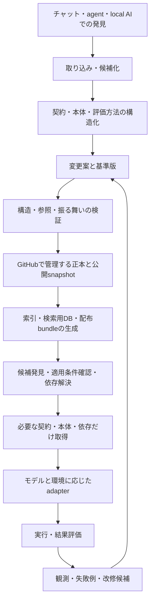

# AKR 上流設計評価

日付: 2026-09-29  
状態: 設計提案。実装・性能測定・既存資産の移行は未実施。

## 0. 結論と判断の範囲

推奨するのは、**小さな共通意味モデルに基づくアルゴリズム・パッケージをGitHubで管理し、検索・配布・実行の表現をそこから構築する構成**である。

Canonicalとは、ある時点で採用された意味を決める正本を指す。正本の意味モデルは一系統に保つが、用途の異なる物理形式まで一種類に統一しない。初期の保存表記には、schemaで制約したJSONレコードと、種別を明示した手続き本体を推奨する。JSONの採用は交換可能な実装判断であり、AKRの意味をJSONの構文だけで定義しない。

上流前提は依頼のPurpose、Absolute Principles、Hard Constraintsである。Non-goalsは対象範囲の確認に用いた。既存AKRの分類、SQLite、Markdown、YAML、JSON等の採用実績は設計上の根拠にしていない。GitHubプラグインと公式一次資料は、Git等の機構の確認に用いた。

以下では、アルゴリズムを「計算手続きに加え、適用条件と評価方法を持つ判断手順・ヒューリスティックを含む再利用可能な方法」と解釈する。すべてが決定的なコードとして実行できるとは仮定しない。この対象範囲を実行可能な計算手続きだけに狭める場合は、コード・型付きIR中心の構成が有力になる。

### 導出できることと、追加判断が必要なこと

| 区分 | 内容 |
|---|---|
| 上流から必須 | 意味と実行適応の分離、版の特定、機械検証、依存追跡、部分取得、競合検出、移行・修復経路 |
| 本設計の推奨 | 資産単位のパッケージ、Gitを正本の履歴基盤にする、共通意味モデル、複数の派生表現 |
| 交換可能な初期選択 | JSONとJSON Schema、ローカル検索用SQLite、語彙検索方式、APIの輸送方式 |
| 実測が必要 | 検索品質、モデル別の再利用成功率、自動改修成功率、運用費、分割すべき規模 |

「AI-native」は、全処理をLLMの推論で行うことを意味しない。AIがライフサイクル操作を開始・計画・評価し、機械的に決まる処理はparser、validator、migration、test runnerで実行することが、継続保守の要求に合う。

## 1. 目的と制約から導く必要能力

| 要求 | 必要能力 | 理由 |
|---|---|---|
| 多様なAI環境からの蓄積 | 取り込み、出典記録、候補化、既存資産との比較 | 発見された方法と、再利用可能と判定された方法を区別する |
| AIによる継続保守 | 型に沿った局所編集、差分検査、構造化エラー、再試行可能な操作 | 毎回全本文を再解釈・再生成すると変更範囲が広がる |
| Explicit semantics | 契約、条件、依存、効果、終了・失敗の共通表現 | 適用可否や組み合わせ可否を機械的に絞れるようにする |
| 大量蓄積 | 段階検索、候補比較、必要部分と依存先だけの取得 | 全件をcontextへ入れずに選択できるようにする |
| 再利用と組み合わせ | 入出力・前提・効果・停止条件の適合判定 | 個別に有効な二つの方法が、接続して有効とは限らない |
| モデル・環境非依存 | 能力要件、実行adapter、環境ごとの適合性評価 | 意味を保ちつつ実行方法を変更する |
| 複数AI | 安定ID、変更基準版、競合検出、統合後の再検証 | ファイルの競合がなくても意味の衝突は起こる |
| 検証・修復 | 構造・参照・振る舞いの検査、破損検知、再構築 | 保存できたことと再利用できることを区別する |
| version・廃止管理 | 不変revision、状態遷移、後継関係、利用停止の伝播 | 旧版の再現と現在の利用判断を両立する |
| Evolution | schema版、reader互換、移行履歴、旧版保持 | 表記変更と意味変更を識別して移行する |

分類は補助能力であり、固定の分類木を中心構造にしない。入出力型、必要能力、適用領域、効果など、複数の軸から探索する。Reasoning Asset等の分類を上流の必須語彙にはしない。

## 2. AIの長期保守管理性をどう評価するか

### 2.1 先に満たすべき条件

以下を満たさない候補は、検索速度や初期実装の簡単さで相殺しない。

- 正本と派生物の境界が判定できる。
- 資産・依存・公開集合の版を一意に特定できる。
- 構造破壊、参照破壊、検査済み範囲のregressionを検出できる。
- schemaと実行環境を変更しても、旧版の意味と取得経路を保持できる。
- 複数AIの変更を、基準版と統合結果に対して検査できる。
- 正本から検索用DB等を復旧できる。

### 2.2 比較の中心となるコスト

評価対象は、ファイルを作るコストよりも、保有期間全体の費用と誤りである。

`保守負担 = 作成・改修 + 影響調査 + 検証 + 検索失敗 + 競合修復 + 移行 + 復旧 + 表現間の同期`

測る単位は、AIの処理時間・使用token・外部計算費・再試行回数・介入回数・未検出の誤りなどに分ける。重みを置く場合も、重大な破損を安価さで打ち消す総合点にはしない。

特に確認する指標:

- 一つの意味変更に必要な編集箇所数と、影響する資産数。
- 自動改修が検査を通って採用される割合と、後から発覚する回帰。
- migrationで無損失に変換できた割合と、意味判断が必要になった割合。
- 資産数増加に対する、取得context量、検索遅延、誤選択、検索漏れ。
- 競合した変更の修復時間と、誤って統合された割合。
- 正本からの再構築時間と、旧公開版へ戻す時間。

この文書の比較は設計上の評価であり、実測順位ではない。現在の入力だけから特定形式の優位を数値で断定することはできない。

## 3. 論理アーキテクチャ

これは論理的な責務分離であり、各箱にサーバーやマイクロサービスを一つずつ設ける提案ではない。初期は一つの実装とローカルDBで構成できる。

### 正本を構成する対象

1. **意味仕様**: フィールド、条件演算、状態遷移、互換性規則の意味。
2. **アルゴリズム・パッケージ**: 契約、手続き本体、宣言した依存、評価仕様、必要な参照データ。
3. **運用状態**: 利用可能性、deprecated・withdrawn、後継関係などの権威ある記録。
4. **保守用資産**: validator、migration、adapter、採用方針。それぞれ独立に版管理する。
5. **採用判断の証拠**: 試験結果、反例、移行報告など、判定に使用した記録。

アルゴリズムの本体と、保守ツールや観測記録は役割が異なる。全てを一つの巨大な資産レコードに入れる必要はない。

### 派生物

全文索引、embedding、検索用DB、逆依存表、一覧、生成済み実行plan、表示用Markdown等。各派生物に元snapshot、generator版、必要ならembeddingモデル版と構築設定を付ける。

ただし、AIが個別に工夫したpromptやadapterは、自動的に再生成可能なcacheとはいえない。再生成手順と適合試験で代替できるものだけを派生物とする。独自の意味判断を含むものは、管理対象のadapterまたはアルゴリズムvariantとして保持する。

## 4. Canonical representationの要件

Canonicalの中心は「抽象的な意味モデル＋その解釈規則」である。schemaはその構造を表すが、フィールド名を並べただけでは意味仕様にならない。

### 4.1 共通の管理契約

| 要素 | 必要な意味 |
|---|---|
| identity | 名前やファイル配置に依存しないID、衝突時の扱い、由来 |
| format / schema | 解釈に必要な版と機能、未知の要素への対応 |
| purpose / applicability | 解く問題、成立条件、適用除外、不明時の扱い |
| inputs / outputs | 型、単位、制約、欠落とnullの区別、成功・失敗結果 |
| requirements / effects | 必要なtool能力、読み書きする状態、外部への作用、再実行の条件 |
| body | 手続きの種別、解釈仕様、安定したstep ID、参照先 |
| termination | 成功条件、失敗条件、中断、反復・時間・費用等の上限 |
| dependencies | 依存種別、互換条件、必要な入力・出力の接続 |
| conflicts | 同時利用できない条件、共有状態の衝突 |
| evaluation | 評価可能な主張、テスト・反例・性質・判定方法への参照 |

全項目を無理に埋めるとAIが推測で補完する危険がある。取り込み時の候補は不完全でも保存できるようにし、実行・公開に必要な情報が揃ったかを別の規則で判定する。`unknown`、`not_applicable`、確認済みの値を区別し、不明を「制約なし」へ変換しない。

拡張要素には名前空間と解釈に必須かどうかを持たせる。未対応の必須要素があれば実行・採用を止める。保持できる任意要素は損失なく引き継ぎ、知らないfieldをmigrationで黙って削除しない。

### 4.2 機械化する意味の範囲

- 型、単位、関係、依存、状態、能力要件、有限の条件式は機械的に扱う。
- 判断・理解・探索など形式化できない部分には、規範となる文章と、例・反例・評価方法を保持する。
- 各条件や手順について、機械判定、実行結果による判定、AIによる判断のどれが必要かを区別する。
- 自然言語の文章を構造化フィールドへ写しても、自動的に形式的意味が得られるわけではない。

条件式には型付き比較、論理演算、集合包含などから始まる小さな演算体系を用い、演算の意味を版管理する。最初から任意コードを条件評価器として許すと、判定の移植性と影響解析が難しくなる。

手続き本体は、宣言的な規則、手順グラフ、コード、規範文章など、種別ごとの解釈器を持つ。共通管理契約を揃え、全資産を初期から単一の汎用実行DSLへ翻訳することは求めない。

規範文章と形式条件が矛盾した場合は無効として検査対象にする。検索用要約、解説、例示は規範とは区別し、要約を根拠に契約を上書きしない。

### 4.3 versionを混同しない

- **Asset ID**: 同じ系統の方法を指す安定ID。
- **Package revision**: 契約・本体・評価仕様等、対象範囲を定めた不変内容の識別子。
- **Schema version**: データの読み方・意味モデルの版。
- **Catalog snapshot**: ある公開集合の資産版・運用状態・解決済み依存を固定したもの。
- **Adapter / evaluator version**: どう実行し、どう判定したかの版。

SemVer風のラベルは補助的に使えるが、互換性は番号だけから確定しない。意味の互換性に関する主張とその検証結果を保持し、実行時は具体的revisionへ固定する。

package revisionのhashは対象範囲と正規化規則を明示し、schema識別子・規範データ・本体等のdigestを含める。自身のdigestを計算対象に含める自己参照は避ける。移行で表記やschemaが変わればdigestが変わり得るため、旧新revisionの対応は別に記録する。

**hashが一致することは内容の同一性を支えるが、正しさや意味の同値性を証明しない。**

### 4.4 正本の単一性はフィールドの所有で保つ

| 情報 | 権威ある記録 | 派生させるもの |
|---|---|---|
| 前提・入出力・効果 | packageの契約 | 検索条件、表示用説明 |
| 手続き | 種別を明示した規範本体 | prompt、実行plan、コード生成物 |
| 依存要件 | packageの依存宣言 | 解決済みlock、逆依存表 |
| 現在の利用状態・後継 | 状態記録 | 一覧や検索結果のstatus |
| モデル別の実績 | 評価記録 | 推奨順位や互換性一覧 |

同じ情報のコピーを一切禁止する必要はない。コピーの由来と無効化条件を定め、複数のコピーを独立に編集することを避ける。依存要件と、その要件を特定snapshot上で解決したlockは役割が異なる。

## 5. 候補比較

意味モデル、serialization、storage、retrieval、runtimeは異なる設計軸である。「MarkdownかSQLiteか」の一表だけでは、それぞれ何を担当させるかが決まらない。

### 5.1 Canonicalの組織化

| 候補 | 保守上の強み | 主な負担 | 判断 |
|---|---|---|---|
| 文書中心＋metadata | 幅広い方法を取り込める | 重要条件が本文に埋まり、改修・検索・依存解析で再解釈が必要 | 取り込みと未形式化部分に有用。単独の中心構造には不足 |
| 型付きrecord＋型付き本体 | 局所変更、機械検査、projection、異種の本体を両立 | 共通語彙とvalidatorを保守する必要 | 推奨 |
| 完全な実行DSL / AST | 形式化した範囲で検査・変換・実行が強い | 表現力の不足、独自言語の維持、認知的手続きの無理な形式化 | 適した資産群への拡張として採用 |
| relational schemaを正本にする | 整合性制約、transaction、集合操作 | Git branchとの往復、DB migration、論理mergeの追加設計 | 有力な代案。今回の初期案では派生DBを優先 |
| RDF等のgraphを正本にする | 複雑な関係と共有語彙を扱える | 手続き実行・版・制約は別途必要。ontologyの維持負担 | 関係推論が支配的になった場合に再検討 |
| event logを唯一の正本にする | 過去の操作を追跡できる | 旧eventの解釈と再生、投影器、補正操作の維持 | 全資産の初期正本には採らず、観測履歴等に限定 |

RDFのgraph制約にはSHACL等を利用できるが、アルゴリズムの実行意味や版管理はAKR側で設計する必要がある。[SHACL仕様](https://www.w3.org/TR/shacl/)

Event sourcingでは過去eventのschema進化と再生処理も保守対象となる。現在状態とGit履歴で要件を満たす初期段階では、その負担を追加する根拠が弱い。[Event Sourcing pattern](https://learn.microsoft.com/en-us/azure/architecture/patterns/event-sourcing)

### 5.2 Serialization

| 候補 | AIによる保守・移行への評価 | 初期の役割 |
|---|---|---|
| JSON＋schema | 構造化patch、schema検査、多くの実行環境との交換に適する。重複key、数値、正規化を規定する必要 | 共通レコードの推奨表記 |
| 制限付きYAML | 同じ意味モデルを記述できるが、許容する構文や型解釈のprofileが必要 | 入力adapterの候補。手編集の便益を採用理由にしない |
| XML＋schema | 型・名前空間を明示できる。関連toolchainが既に有力なら合理的 | JSONと比較可能だが、上流要件から必須ではない |
| Protobuf等のIDL形式 | 型付き通信と生成コードに適する。wire互換と意味互換は別 | 高頻度の通信・配布に必要なら採用 |
| CBOR等のbinary | 型と容量の要件に合う場合がある。profileと検査・比較toolが必要 | 配布・cache候補 |
| Markdown | 規範文章、解説、由来を保持できる。意味構造は別途必要 | 文章本体または生成view |

YAMLを使う場合、tag・alias・型解決等のどこまでを許可するかをprofileとして固定する。[YAML 1.2.2仕様](https://yaml.org/spec/1.2.2/)

Protobufの決定的serializationもCanonicalなバイト表現ではなく、schemaや実装の変更にまたがるhashの安定性は別途設計が必要になる。[Protobuf serialization](https://protobuf.dev/programming-guides/serialization-not-canonical/)

JSON Schemaが直接検証するのは型や構造的制約等である。依存の存在、手順の正しさ、契約の意味保存には別のvalidatorが必要。[JSON Schema Validation](https://json-schema.org/draft/2020-12/json-schema-validation)

hash用のJSON正規化にはJCSを候補とするが、重複keyを排除し、数値範囲を決める必要がある。大きな整数・精密な小数は型を明示した文字列等で扱う。JCSはUnicode正規化や意味の同値化を行わない。[RFC 8785](https://www.rfc-editor.org/info/rfc8785/)

### 5.3 Storage・索引・交換・runtime

| 層 | 初期推奨 | 拡張または代案 |
|---|---|---|
| 正本保存 | GitHub上の資産単位package、意味仕様、状態記録、保守tool | 負荷に応じたrepo分割。大きなblobはdigest付き保管先へ |
| 検索用保存 | 再構築可能なrelational DB＋全文索引 | 多拠点・高並列時にserver DB / search service |
| 関係索引 | 依存・後継・競合の隣接関係と逆引き | 多段の関係探索が主要処理ならgraph DB |
| 類似検索 | 語彙検索と構造条件を基礎に評価 | 検索漏れの改善を確認してembeddingとrerankingを追加 |
| 交換 | manifest＋package＋固定依存を含む自己完結bundle | 大量streamにJSONL、通信量が支配的ならbinary |
| runtime | 解決済みの契約と必要本体をadapterで展開 | 手順graph、コード、tool呼び出し、段階的な対話 |

SQLiteは移植可能な保存形式であり、正本になれないわけではない。[SQLite Single-file Cross-platform Database](https://www.sqlite.org/onefile.html)

今回、SQLiteを主に派生DBへ置く理由は、人間に読めないからではなく、**複数AIによるGit branch上の局所変更・統合・移行を、資産単位の構造化recordで扱う方が初期の保守経路を短くできる**という設計判断である。DB正本に高度な論理merge・変更API・再現可能exportを備えた案が実測で上回れば、この判断は変える。

結論は「単一の意味モデル＋役割の異なる複数形式」。各変換は入力版、出力版、変換tool版、損失の有無を持つ。全形式間の相互変換を増やさず、共通モデルを中心に変換経路を限定する。

## 6. 検索・選択・ロード

1. 依頼を、目的、入力、欲しい出力、使用可能な能力、制約へ整理する。
2. 検索用viewから候補を取得する。既知の不適合は除外し、条件不明は不明のまま示す。
3. 小さな候補情報から、目的・適用条件・効果・評価根拠を比較する。
4. 有望な候補の正本契約を取得し、適用条件と現在の状態を確認する。
5. snapshotを固定して依存を解決し、必要な本体・評価例・依存だけをロードする。
6. 環境に適合するadapterを選択する。適合が確認できなければ追加検証・別候補・利用見送りへ分岐する。

検索結果にはasset ID、revision、適用条件、未確認条件、概算の負荷、評価対象の範囲を含める。類似度だけで実行を確定しない。該当する道具がないという結果も正式な結果とする。

候補件数と取得tokenに予算を設ける一方、top-kを固定すれば必ず必要なものを発見できるとはしない。検索漏れを評価し、絞り込みの緩和や追加検索の規則を持つ。

embedding、分類cluster、ランキングは再生成可能な検索表現とする。embeddingモデルを変えてもasset IDや契約は変わらない。索引から得たstatusを信用し続けず、採用時には権威ある状態を確認する。

### 組み合わせ

最低限、出力と入力の型・単位、前提と事後条件、共有状態への作用、順序、依存版、終了と費用を検査する。型が接続できても、意味が接続できるとは限らない。判定できない条件は組み合わせ試験で確認する。

再利用する複合手順は新しいassetとしてID・契約・依存・評価を持たせる。一回限りの組み合わせは実行planとして記録する。全資産の全組み合わせを先に試験する構造にはしない。

## 7. モデル・環境への適応

モデル非依存で目指せるのは、**意味、必要能力、評価基準を特定モデルから分離すること**である。どのモデルでも同じ成功率や出力になるという保証ではない。

| 環境 | 適応例 |
|---|---|
| chat | 契約、手順、例、停止条件を段階的に提示し、必要な時だけ追加入力する |
| tool-using agent | 型付き入力をtoolへ接続し、状態・予算・出力をvalidatorで検査する |
| local AI | 短い段階への分解、必要な例の追加、計算処理の外部実行などを適合試験に基づいて選ぶ |
| cloud / future runtime | 共通契約と能力記述から利用可能な実行方式を選ぶ |

localかcloudかだけからモデル能力を決めつけない。判断の根拠は、対象タスク、model/runtime構成、adapter版、評価集合に対する観測結果である。

外部取得・file入力・tool呼び出しのないchatには、大量の外部資産を自律検索する経路がない。その環境に対してはhost側の取得機構またはbundle供給が必要である。完全な環境非依存を「入出力能力のない環境でも全機能が動く」とは定義しない。

adapterは規範契約を変更しない。能力不足のために前提・禁止条件・成功条件を緩めるなら、同じアルゴリズムの単なる表示変更ではなく、別variantまたは新revisionとして評価する。

資産が宣言する必要能力と、環境から実際に与えられる権限は分ける。adapterは両者を照合し、取得した手順の記述だけで実行権限を増やさない。

### 具体例: 制約で候補を絞って比較する方法

- 入力は候補集合、制約、比較基準。
- 制約の判定は `true / false / unknown` を区別する。
- 必須制約が `false` の候補を除外し、`unknown` は追加確認の対象にする。
- 出力は採用候補、除外理由、未確認事項。未確認が残る場合の結果状態も定義する。
- chatでは候補を順に点検し、agentではtoolで情報を取得しながら点検できる。

このとき、小さいモデル向けのpromptが `unknown` を自動的に合格扱いしたら、意味が変わっている。その違いを検査する試験は、promptの文面一致ではなく結果と分岐の条件を見る。

## 8. GitHub・複数AI・公開の整合性

AIは、基準snapshotを読んで変更案を作り、branchまたはPRとして提出する。採用方針に従う自動検査と統合処理を組み合わせ、人間が毎回手動で整理・mergeする前提にはしない。

### 公開までの処理

1. 変更案に基準commitと対象revisionを付ける。
2. 資産単位の構造差分を作る。長い配列を位置だけで編集せず、step ID等で特定する。
3. 構造、参照、状態、互換性、対象資産と影響先の試験を実施する。
4. 他の変更が入った場合は基準を更新し、実際に統合する内容を再検証する。
5. 正本のcommit、固定依存、検証証拠、生成物を紐付けた公開snapshotを準備する。
6. 完成したsnapshotへの参照を一度に切り替える。読者は一つのsnapshotを固定して利用する。

ファイルの自動merge成功は意味競合がない証拠にはならない。例えば、一方のAIが出力単位を変更し、別のAIが利用側の計算を変更した場合は、異なるファイルでも統合試験が必要になる。

Gitのref更新には期待する旧object IDを指定して食い違いを検知する機構がある。これは基準版検査を実装する部品になるが、それだけで遠隔公開や意味競合が解決するわけではない。公開処理は単一のsnapshot参照を扱うようにする。[Git update-ref公式仕様](https://github.com/git/git/blob/master/Documentation/git-update-ref.adoc)

GitHubのmerge queueは最新の対象branchと先行変更を含めた検査に利用できる。ただし利用条件があるため、利用できない場合は同等の直列統合処理を用意する。Actionsを使う場合はmerge groupの検査も必要になる。[GitHub merge queue](https://docs.github.com/en/repositories/configuring-branches-and-merges-in-your-repository/configuring-pull-request-merges/managing-a-merge-queue)

### 状態と後継

- `candidate`: 不完全または評価中。通常の自動選択から外す。
- `active`: 定義した公開基準を通過した利用候補。全環境での有効性を意味しない。
- `deprecated`: 新規採用を抑える。既存利用の扱いと移行先を記録する。
- `withdrawn`: 利用を停止する必要がある版。検索、cache、実行開始時へ伝播させる。
- `superseded_by`: 別の状態値に押し込めず、後継との関係・条件・根拠として記録する。

後継を登録しても互換性が証明されたとは扱わない。後継関係の循環、参照先不在、版の不整合を検査する。履歴から旧版を取得できることと、その旧版を現在使ってよいことは別である。

内容と依存の再現には固定snapshotを使うが、実行開始時には現在の利用停止記録も確認し、その判断を旧snapshot内の状態より優先する。rollbackによって`withdrawn`を暗黙に解除しない。実行記録には内容snapshotと、確認した利用停止記録の版を残す。offline利用では確認情報の有効期間と、更新できない場合の扱いを運用方針として定める。

## 9. Validationとrepair

| 検査層 | 対象 | 保証できないこと |
|---|---|---|
| 構文・schema | 型、必須項目、未知の必須機能、条件式の構造 | 方法の正しさ |
| 参照・整合性 | 依存先、revision、状態遷移、後継関係、hash | 未記述の依存や競合 |
| 契約・組み合わせ | 入出力、前提・事後条件、効果、終了条件 | 形式化していない意味の全検証 |
| 振る舞い | 代表例、境界例、反例、性質、変換前後の比較 | 未試験の全入力における正しさ |
| モデル・runtime | タスク別の成功率、費用、adapter適合性 | 別モデルや将来版への自動一般化 |
| システム | 索引再構築、同時更新、破損注入、rollback | 外部世界の状態の自動復元 |

AIによる意味レビューは補助証拠として使えるが、変更者と同じ判断を繰り返すだけでは独立した検証にならない。機械判定できる性質、独立した反例探索、既存の評価集合を組み合わせる。

確率的な振る舞いは単発の成功で合格にせず、試行回数、入力分布、model/runtime版、成功条件、ばらつきを記録する。試験がない資産は未検証として扱い、型検査通過を意味検証済みへ読み替えない。

repairは失敗箇所を特定し、新revisionを作り、対象と影響先を再検査する。検査を弱めて成功扱いにする変更は、アルゴリズム修正とは別の評価方針変更として確認可能にする。

validator、評価仕様、採用方針そのものの改修は、変更前に固定した受入規則と独立した適合試験で評価する。変更後の基準だけを、その変更自身の受入れ根拠にしない。これは旧schemaのvalidatorで新版データを直接検査する要求ではなく、検査基盤の変更に循環した合格判定を持ち込まないための規則である。

rollbackでは旧snapshotへ戻せるようにする。外部への書き込み・送信・課金等の作用はGitのrollbackでは戻らないため、作用を持つ方法には再試行条件や補償手順の有無を契約として持たせる。

## 10. Migrationと形式変更

### 10.1 変更を四種類に分ける

| 変更 | 例 | 主な判定 |
|---|---|---|
| serialization | JSONから別encodingへ | 読み戻した値、型、文字列、参照の保存 |
| schema / 意味モデル | field分割、条件演算の変更 | 意味写像、不明値の扱い、旧新の適合試験 |
| algorithm | 手順・前提・出力の変更 | 新revisionとして振る舞いと利用側への影響を検証 |
| projection / runtime | 索引方式、embedding、adapterの変更 | 検索品質または実行適合性。資産の意味変更と混同しない |

単純なfield名変更と、自然言語から未知の意味を推測する処理を同じmigrationとして扱わない。後者は意味抽出の変更案として保存し、判断不能なものを正常移行済みにしない。

### 10.2 移行手順

1. 対象snapshotと旧reader・validatorを固定して保持する。
2. 変換規則、対応するschema版、tool版、処理IDを保存する。
3. 別の候補集合へ変換する。途中失敗・再開・重複実行の扱いを定める。
4. 件数、ID、参照、digest、型付き値、必須意味の対応を照合する。
5. 意味を保つと主張する変換は、読み戻し、旧新の論理比較、契約試験等で確認する。hash一致だけを要求しない。
6. 必須情報を導出できない資産を分離し、解決されるまで旧版readerで扱うか新公開集合から外す。
7. 新しい索引とruntimeを並行構築し、同じ問い合わせ・評価課題で比較する。
8. 採用条件を満たしたsnapshotへ切り替え、旧snapshotと取得経路を保持する。

互換移行期間に複数readerを持つことはできるが、同じ意味を二つの正本へ独立に書く運用は避ける。一定期間の旧新版保持は履歴・移行のためであり、恒久的な二重編集とは区別する。

無損失の逆変換が不可能な移行もある。その場合は旧版を保持することがrollback手段となり、逆migrationを必ず生成できるとは約束しない。利用中の版を参照するcommitやblobは保持対象に含める。

## 11. 規模拡大への備え

初期から大量の全件読み込みと単一の巨大ファイルを避ける。資産単位の変更、IDによる配置分散、内容digest、逆依存索引を使い、通常の改修は「変更資産＋影響する依存先」に検査・再構築を絞る。

ただし、全資産に関わるschema変更や、広く依存される共通契約の変更では全件に近い処理が必要になる。規模に関係なく定数時間で保守できるとはしない。局所変更を全件処理にしないことと、広範な変更を明示的に扱うことが目標である。

- 検索では毎回GitHubへ全件取得しない。公開snapshotの索引と必要packageを配布する。
- 索引は差分更新し、元snapshotの不一致や欠損を検出した場合は再構築する。
- 実行ログ・embedding・大量の生成物を正本repoへ無制限に積まない。
- repoのsize、変更頻度、clone時間、検査時間、統合待ち時間を計測して分割を判断する。
- repoを分割する場合は、各repoのcommitを固定した上位snapshotで公開集合を定める。
- 外部blobはdigestだけでなく保持・再取得経路を持つ。hashから失われた実体を復元することはできない。

GitHubにもrepo構造、活動量、object等に関する制約があるため、単一repoが際限なく拡大しても同じ運用でよいとは仮定しない。[GitHub Repository limits](https://docs.github.com/en/repositories/creating-and-managing-repositories/repository-limits)

## 12. 初期構成と採用判断が変わる条件

### 最小構成

- 意味仕様とschema。
- IDごとのpackage。契約はJSON、本体は宣言した種別の形式。
- 状態記録と、公開snapshotを構成する仕組み。
- validator、migration runner、検索用projection builder。
- 構造条件＋語彙検索。ローカル検索DBにはSQLiteを候補とする。
- 共通の操作interfaceと、chat / agentへ接続するadapter。
- GitHub上の変更案・統合検査・履歴と、snapshot切替による公開。

操作interfaceは、`discover`、`resolve`、`fetch`、`validate`、`propose_change`、`migrate`、`publish`、`deprecate`、`rebuild`、`rollback`等の責務を持つ。CLI、HTTP、特定agent用toolはこのinterfaceを接続する輸送方式とする。特定protocolをCanonicalの意味にしない。

初期からgraph DB、vector DB、分散event bus、独自汎用DSLを必須にはしない。共通interfaceの内側を差し替えられることを先に確保する。

### 推奨が変わる条件

| 観測された条件 | 再検討する案 |
|---|---|
| 資産の大半が厳密に実行可能で、形式検証の効果が大きい | 型付きIR / DSL / code packageを本体の中心へ |
| 高頻度・高並列の更新が支配的でGit統合が律速 | DB正本＋論理変更履歴＋GitHub管理されたschema・変更set・固定snapshot |
| 多段の関係推論が検索・保守の中心となる | graph表現とontologyへの投資 |
| 通信量やdecode費用が支配的 | Protobuf / CBOR等の交換形式 |
| 語彙検索の漏れが再利用を妨げる | embeddingとrerankingの追加・調整 |
| ほぼ全件が長い判断手順で形式化の費用が便益を超える | 共通管理契約を維持し、本体の規範文章の割合を増やす |

DB正本へ移す場合も、GitHubが変更履歴・branch・rollbackの実質的な管理基盤であるというHard Constraintを満たす必要がある。たまにDBをexportするだけでは、並行変更や戻す単位が失われる。DBのtransaction境界とGitの変更set・snapshotの対応を設計し、同じ比較試験で評価する。

## 13. 採用前に行う比較試験

設計提案を実証するには、現在のAKRから独立した同じ入力集合で候補を比較する。

### 入力

- 決定的計算、条件分岐、探索、判断手順、tool利用、状態変更、複合手順を含む代表集合。
- 不完全な説明、矛盾、重複、旧版依存、廃止済み依存を含む境界例。
- 100、1,000、10,000件以上の規模段階。人工複製だけの試験は実際の意味検索品質を代表しない。

### 比較する作業

1. 同じ内容から候補を作成し、検査可能なpackageへする。
2. 適切な資産がある課題・ない課題で検索し、選択根拠を判定する。
3. 前提変更や出力変更を行い、利用側への影響を見つける。
4. 二つのAIが同じ基準版から異なる変更を行い、競合を統合する。
5. 新schemaへ移し、不明な意味が勝手に補完されないかを確認する。
6. 索引を削除・破損させ、同じ公開集合を再構築する。
7. chat、tool利用agent、異なる能力のモデルで適合性を比較する。
8. 公開後に旧版へ戻し、依存と利用停止状態の扱いを確認する。

### 受入基準

- 導出不能な必須意味を、正常な値として移行しない。
- 依存欠損、古い基準への更新、既知の構造破壊を検出する。
- 一つの利用で、内容・依存の異なるsnapshotを混在させない。現在の利用停止確認は別に記録する。
- 索引は正本から復旧でき、再生成後の一致対象を検証できる。
- 自動改修の成功と、意味評価が未確認の状態を区別する。
- 検索漏れ、誤選択、費用、回帰の閾値を用途別に定めて比較する。
- 変換・索引・依存解決のように決定的にできる部分は再現可能にする。LLM結果や近似索引には適切な統計的・機能的同等性の基準を用いる。

## 14. 最終判断

本設計で先に固定すべきなのは、ID、契約の意味、版の区別、状態、検証・移行・公開の規則である。そのうえで、初期実装には**GitHub上の型付きpackageを正本とし、JSONを共通レコードの表記、検索DB・索引・runtime bundleを用途別の表現とする構成**を推奨する。

この構成は、同じ意味を別々のpromptやDBへ独立に書き続ける負担を減らし、局所改修と移行の範囲を特定しやすくする。一方、任意のアルゴリズムの意味保存を自動証明することや、全モデルでの成功を保証することはできない。未形式化部分と未評価の適用範囲を管理対象として残すことが、長期保守の前提となる。
