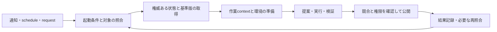

# AKR External Landscape / Architecture Assumption Delta Audit

2026-09-30 · analysis draft · 基準: 2026-09-29 Coverage Audit

## 0. 今回変更する探索地図

既存のPurpose / Principles / Constraints、D01〜D47、F1〜F8、R0〜R7を引き継ぐ。外部実装と新しいplatform能力によって、**比較すべき契約と実験条件**を更新する。

- **D48 Activation / Trigger Model**と**D49 Working Context / Materialization**を、探索地図の独立した問いとして追加する。必須componentやschema fieldの追加ではない。既存次元への吸収案と反例は§5で比較する。
- F1〜F8は維持する。event-driven化、workspaceの実体化、cloud/local配置は、各familyと組み合わせて比較する。新しい製品が登場しただけではfamilyを増やさない。
- Interface Capacityには作業コンテキストと実行環境を明示する。backendの機能、経路が公開する機能、特定modelが実現した成果を分ける。
- **Change Absorption Capacity（変更吸収能力）**は横断的な評価属性に加える。独立次元にはしない。現在のmodel/harnessを交換する費用だけでなく、不要になった補助構造を撤去する費用も比較する。
- R1を先行する方針を維持し、R3の起動・再開、R5のコンテキスト鮮度・公開境界を早める。R2、R4、R6、R7には具体的な反例を追加する。

最終Architecture、Canonical format、DB、IR、schema、製品採用は未決定。以下は候補の性能順位を示す報告ではない。

## 1. 基準、入力、証拠の扱い

基準は[Architecture Search-Space Coverage Audit](./2026-09-29-architecture-search-space-coverage-audit.md)。GitHub commit `80265d25cf8c6e9ef4093929cecebe78547e2a4b`にある版を使用した。基準ファイルのSHA256は `77a731ee31c75ff84837c54fc6caa05d5a35e597a1e76d5595481c8c78320cc4`。全面Coverage Auditは再実行していない。

新入力は[2026-09-30 DevDay / AI architecture整理](./inputs/2026-09-30-devday-ai-architecture-input.txt)。添付のbytesを保持し、SHA256は `c40446c28ae7c9ded544c8629ace765223fad11d3761e2fdb393188d2612a579`。このほか、ユーザー本文で追加された変更吸収能力と研究の分業・context配分の観点を§9、§12へ反映した。入力中の暫定構成や製品紹介を新しい上流要件にはしていない。

調査は、分野別の一次資料収集、読了範囲の保存、差分判断、独立した次元レビューの順で進めた。GitHubのIssue、コメント、固定版release、migration notes、code、公式仕様を使う。個別の読取範囲は次の補助ノートに残す。

- [Memory / skill / MCP registry](./landscape-notes-memory-2026-09-30.md)
- [Events / durable execution / distributed state](./landscape-notes-events-2026-09-30.md)
- [Registry / lineage / preservation](./landscape-notes-assets-2026-09-30.md)
- [次元追加の独立レビュー](./delta-dimension-review-2026-09-30.md)

補助ノートの「未読」は各担当の終了時点を表す。主担当によるDVC、MLIR、OCFL本文の後続確認は§2に区別して記す。外部ページは固定版を明記したもの以外、2026-09-30の取得時点の記述である。仕様上の保証、利用者報告、maintainerの説明、修正済み問題、AKRへの推論を分ける。Issueがopenであることだけでは、最新releaseに問題が残るとは判定しない。

## 2. External Landscape findings と設計次元mapping

### 2.1 選定した問題領域

選定基準は、AKRとの名称の近さではなく、意味の変更、部分取得、継続実行、並行保守、移行で異なる反例を得られるかである。同じ問題の事例を増やすより、別の境界で保証が切れる事例を優先した。

以下のE番号は証拠をまとめるための参照番号であり、新しい設計次元ではない。Dは既存地図、F/Rは候補familyと研究束への対応である。D48/D49への対応は§5の判断後に付与した。

### 2.2 Agent memory / registry

| 証拠 | 確認した事実と限定 | AKRに追加する比較問題 | 対応 |
|---|---|---|---|
| E01 Mem0 [migration guide](https://github.com/mem0ai/mem0/blob/94c3fe9f238f3dbf29c9ce98643bd71eb13077cd/docs/migration/oss-v2-to-v3.mdx)、[#7452](https://github.com/mem0ai/mem0/issues/7452)、[#7440](https://github.com/mem0ai/mem0/issues/7440) | ADD-only化とretrievalでの現在情報選択、semantic候補内のkeyword boostを固定版で確認。削除後の再抽出、close時のpayload/history不一致は利用者報告と関連codeを確認。release修正・再現は未検証 | 変更判断を読取側へ移す案、原資料からの再登録、履歴欠落、検索名と候補発見能力の差を課題へ追加 | D01/18/21/22/28/30/36/44/46/47、F2/F3/F4、R1/R4/R5/R7 |
| E02 [LangMem manage tool](https://github.com/langchain-ai/langmem/blob/9d033b47d9ce53e37e92c92241b0496c0278932e/src/langmem/knowledge/tools.py) | action・namespace・schemaを制限する目的別tool。読んだupdate引数にはexpected revisionがない。任意backendの追加保証は否定しない | purpose toolの存在とstale-write拒否・transaction保証を別評価 | D18/20/21/38/40、F2、R1 |
| E03 Letta [repair](https://github.com/letta-ai/letta-code/blob/039cd6af623c24d1e88531325117d053e78d1615/src/agent/memory-conflict-repair.ts)、[skill参照](https://github.com/letta-ai/letta-code/blob/039cd6af623c24d1e88531325117d053e78d1615/src/agent/shared-memory-skills.ts)、[repo移管PR](https://github.com/letta-ai/letta/pull/3430) | repairのclaim tokenと同状態の再試行抑制、attachmentを基準にしたskill解決を固定版で確認。旧入口repoから現行sourceへの案内変更も確認。動作試験は未実施 | repair自身の競合、残存fileの再露出、repo名が同じでも実装世代が変わる問題 | D05/20/22/31/34/41/44＋D48/D49、F1/F4/F7、R1/R3/R5/R6 |
| E04 MCP Registry [versioning](https://github.com/modelcontextprotocol/registry/blob/bf4e88cbe8d1a635c06144ccea1d24cb52fa6186/docs/modelcontextprotocol-io/versioning.mdx)、[latest修復](https://github.com/modelcontextprotocol/registry/blob/bf4e88cbe8d1a635c06144ccea1d24cb52fa6186/internal/database/migrations/014_heal_is_latest.sql)、[#1106](https://github.com/modelcontextprotocol/registry/issues/1106) | 不変publicationと可変status/latest、latest修復SQLを確認。旧不変版のURL一意制約がnamespace移管を妨げる利用者報告。運用DB・最新修正は未検証 | 本文固定だけで採用pointerは健全にならない。identity、locator、所有権、旧履歴保持の制約を移行課題へ | D04/15/20/21/24/33/34/44、F2/F4/F7、R1/R4/R5/R6 |

4 project / 5 repositoryを扱った。固定head、読んだcode範囲、Issueの日時・状態は[memoryノート](./landscape-notes-memory-2026-09-30.md)に記録した。複数の観察が同じIssueを根拠にする場合、独立した障害件数に数えない。

### 2.3 起動、継続実行、分散状態

| 証拠 | 確認した事実と限定 | AKRに追加する比較問題 | 対応 |
|---|---|---|---|
| E05 [Temporal workflow definition](https://docs.temporal.io/workflow-definition) | replayでは履歴に対するcommand列の整合性が必要。定義変更に互換性制約がある。公式文書、実行未検証 | 意味revision、実行コード、進行中instanceの継続可能版を別判定。旧workerを残す費用を含める | D12/15/33/35/45、F6、R3/R6 |
| E06 [Restate v1.7.0](https://github.com/restatedev/restate/blob/v1.7.0/release-notes/v1.7.0.md) | leader交代時のsignal消失修正、prefix restartのseed保存と旧版へのrollback制約を記載。2026-06-18公開の固定版 | log保存、dedup、適用完了は別境界。Gitで定義を戻せることとdurable stateを戻せることを区別 | D12/20/33/35/43、F3/F6、R3/R6 |
| E07 [Argo trigger conditions](https://argoproj.github.io/argo-events/sensors/trigger-conditions/)、[Sensors](https://argoproj.github.io/argo-events/sensors/more-about-sensors-and-triggers/)、[API](https://argoproj.github.io/argo-events/APIs/) | 異なる日のA/Bが結合する例とresetを説明。bus配送保証とtriggerの実行設定も別 | 起動の相関、時間窓、対象revision、ack境界を一つの契約として比較 | D12/39/42/47＋D48、F3/F6、R3/R5 |
| E08 [controller-runtime cache](https://kubernetes.io/blog/2026/07/29/controller-runtime-cache-explained/)、[#2831](https://github.com/kubernetes-sigs/controller-runtime/issues/2831) | cached readとAPI writeのずれを公式解説。status更新後のreconcileは2024年のmember回答で想定挙動。無限loopの現行欠陥とする証拠ではない | eventごとの処理と、対象をdirtyにして現在状態へ収束させる処理を比較。保守操作が次の保守を呼ぶ循環を検査 | D18/20/31/42/43＋D48、F1/F2/F6、R1/R5 |
| E09 [Automerge sync](https://automerge.org/automerge/automerge/sync/index.html)、[conflicts](https://automerge.org/docs/reference/documents/conflicts/)、[repo #264](https://github.com/automerge/automerge-repo/issues/264) | syncにtransport前提がある。過去Issueでは受領とstorage永続化の隙間をcontributorが説明。現在版の再現は未確認 | 複製の収束、意味上の採用、永続化済みcopyの存在を分ける。最後の保持peerを失う場合を検査 | D19/20/22/25/34/43、F4/F7、R5/R6 |

E06の関連PR本文まで確認したとは扱わない。E07の特定busについての設定値を、すべてのbusやMCPへ転用しない。詳細なversion、コメント、読了範囲は[eventsノート](./landscape-notes-events-2026-09-30.md)にある。

### 2.4 Registry、依存、build、IR、保存

| 証拠 | 確認した事実と限定 | AKRに追加する比較問題 | 対応 |
|---|---|---|---|
| E10 [MLflow #17066](https://github.com/mlflow/mlflow/issues/17066) | 3.1.4で、version指定loadのalias一覧が古くなる利用者報告。本文・コメント読了、current code未検証 | 不変本文と可変の採用・alias情報は鮮度が異なる。実行loadと保守用列挙の能力も別評価 | D15/24/31/38/44、F2/F7、R1/R5 |
| E11 [OpenLineage #4359](https://github.com/OpenLineage/OpenLineage/issues/4359) | 一つのrunの入出力集合では個別の依存が曖昧になるという提案。run分割案との議論、facetの解釈・consumer対応の議論を確認。後続PRの完成状態は未確認 | アクセス集合から全対全の依存を推定しない。変更影響を過大にしない粒度と、旧readerのfallback意味を比較 | D03/07/09/17/21/33/46、F1/F4/F6/F8、R2/R4/R6 |
| E12 [DVC checkout](https://doc.dvc.org/command-reference/checkout) | Gitが参照fileを変更してもDVC管理dataの展開は別操作。cache欠落時には部分的な進捗があり得る。主担当が公式本文を追加確認 | 版の解決、payload取得、作業領域への展開、利用可能判定を分ける。参照が揃っていてもcontextが完全とは限らない | D09/25/26/31/43＋D49、F1/F7、R5 |
| E13 [DVC 2.x→3.0 migration](https://doc.dvc.org/user-guide/upgrade) | 改行正規化を伴うhash方式を変更。旧cache読取を残し、新cacheを分離。workspaceの参照移行とGit履歴書換えは別。主担当が本文確認 | bytesの同一性と正規化上の同一性、名前空間、旧履歴の読取を別契約にする。全履歴を書換えない移行も比較 | D04/15/24/27/33/41、F1/F7、R6 |
| E14 [MLIR Bytecode Format](https://mlir.llvm.org/docs/BytecodeFormat/) | bytecodeの互換性説明はdialect不変を前提とし、dialect独自のversion・upgrade用hookを用意。主担当が本文確認 | serializationの安定性だけでoperationの意味互換性を主張しない。変換器・dialect・readerの責任範囲を比較 | D06/15/27/33/46、F8、R4/R6 |
| E15 [OCFL 1.1](https://ocfl.io/1.1/spec/) | digestを介して保存位置と各versionの論理配置を分離。複数inventoryの一致規則を規定。主担当が該当本文を補足確認、実装未評価 | 保存bytes、公開集合、作業中の配置を別管理できる。規範の二重編集を増やさず冗長保存する案を残す | D05/16/24/32/34/41/43、F7、R5/R6 |

E10/E11の読取範囲は[assetsノート](./landscape-notes-assets-2026-09-30.md)にある。E12〜E14は担当の未完部分から、差分判断に直結する一次資料だけを主担当が補った。E15は保存仕様の例であり、産業・航空宇宙の長期運用実証とは扱わない。

### 2.5 成熟分野から持ち込める部分問題と限界

| 比較に使える既存パターン | AKRで残る問題 |
|---|---|
| replay互換性、checkpoint、version付きworker、明示的なrollback境界（E05/E06） | LLM判断や外部世界の変化を含むと、同じ結果を再生すべきか、新しく判断すべきかは資産の契約次第 |
| correlation/window、dedup、reconciliation（E07/E08） | 何を同じ意味の起動とするか、どの変更を再評価するかはAKR側が定める |
| snapshotとmaterialization、旧reader併存、cacheの名前空間移行（E12/E13） | 部分contextや変換後表現でも、必要な意味・停止条件が保存されているか |
| domain別version/upgrade、version inventoryとfixity（E14/E15） | 解釈の正しさ、採用判断、現在の実行環境での妥当性は別の証拠が必要 |

成熟した機構を再発明する必要は減らせるが、機構名だけでAKRの意味保全が満たされるわけではない。今回のscanは代表的な反例の収集である。knowledge graph専用実装、evaluation platform、industrial/aerospaceの現行運用について、新しい深掘り比較を完了したとは主張しない。

## 3. 新platform入力の確認と補正

以下のP番号は新しい観測・仮説を区別するためのもの。公式文書の存在は、このセッションやユーザーのaccountに同じ能力が公開されていることの実証ではない。

| 入力 | 一次資料から確認した範囲 | AKRへの推論・残る限定 |
|---|---|---|
| P01 MCP Events | [公式guide](https://developers.openai.com/plugins/build/mcp-events)はMCP 2.0 / `2026-07-28`を要求し、draft Eventsのwebhook方式を説明。ChatGPT integrationはpolling/streamingと`gap`/`terminated`を未対応。2xxは非同期処理の受領であり、順序逆転やcursorなしのreplay不能も扱う | event-driven activationが具体的な候補になる。配送・起動・処理・採用の保証を分ける。製品固有の非対応項目をCanonicalな意味へ埋め込まない |
| P02 Codex cloud / reusable environment | [現行guide](https://learn.chatgpt.com/docs/environments/cloud-environments)はpublished filesystemから新task用workspaceを作り、既存taskの状態は維持すると説明。save/publish/shareが別で、保存状態はsource controlを代替しない | environmentの再利用とtaskのcontext鮮度は独立。republishで既存taskも更新されたとみなさない。旧[Codex Cloud Legacy](https://learn.chatgpt.com/docs/environments/cloud-environment)のcache/setup条件を混ぜない |
| P03 Plugin Extensions | [Extensions](https://developers.openai.com/plugins/build/extensions)にsidebar、conversation panel、file viewer/editor等。[UI guide](https://developers.openai.com/plugins/build/chatgpt-ui)はserver側のbusiness state、UI state、model-visible contextを区別 | 操作面の選択肢を増やす。画面に見える内容、modelが受け取る内容、保存された内容は別。公式にはFree/Go webはcoming soon、composer mentionはdesktop限定で、入力の提供範囲は機能ごとに読む |
| P04 Library / Space / Pages | [Space](https://learn.chatgpt.com/docs/space)、[Pages](https://learn.chatgpt.com/docs/space/pages)はnativeな編集・協働と外部参照を持つ。参照元の権限と、pageへコピーした内容の共有範囲は別 | Spaceを「捨ててよい派生物」にするのはAKRの設計選択。native編集を受けるならcapture/writebackが必要。Libraryの容量・提供範囲・保持契約は今回未確定 |
| P05 GitHub + Local Git / worktree / PR | [Git worktrees](https://learn.chatgpt.com/docs/environments/git-worktrees)は作業場所、隔離されたcheckout、handoffを説明 | checkoutの分離は権限・processの隔離まで保証しない。local未確定状態とGitHubで管理する採用状態を結ぶ。PR作成・審査・mergeは別の操作 |
| P06 structured backend + purpose tools | D38の既存候補に対応。P01/P03はMCP経由の公開方式を増やすが、backendのtransactionがそのままAIへ公開される保証はない | SQLite、graph、object等の優劣は決まらない。`query/preview/validate/commit/status/repair`等の語彙と保証を課題から比較する |
| P07 cloud model / local AI / executor | [Agents architecture](https://developers.openai.com/api/docs/guides/agents-api/architecture)、[self-hosted environment](https://developers.openai.com/api/docs/guides/agents-api/environments/self-hosted)はhosted harnessと外部executorを分離。後者はoutbound WebSocketで接続する | model、harness、executor、dataの所在地を別指定できる。local実行だけでlocal推論や情報の域外不送信は保証されない。localhost境界を越えるには明示した接続が必要 |

P02の検索結果には旧文書の説明が残っていたため、取得した本文の位置付けを優先した。modelの広告上の能力・価格だけからcloud/localの担当を固定する根拠は得ていない。

## 4. Architecture Assumption Delta

判定略号: **N** = no material change、**S** = strengthens existing conclusion、**O** = expands option set、**P** = changes research priority、**C** = contradicts previous assumption、**M** = requires dimension modification、**D** = requires new dimension。主判定と必要な副判定を併記する。Cは、どの文書のどの仮説に反するかを限定する。

| 新情報 | 判定 | 基準との差分と処置 |
|---|---|---|
| P01＋E07/E08: 通知、相関、現在状態への再照合 | **D**, O, P | D39/D42だけでは「何が仕事を発生させたか」を一括比較しにくい。D48を追加しR3/R5へ |
| P02/P04＋E12: reusable環境、編集workspace、別途のdata展開 | **D**, M, P | D30/D46だけではtaskに拘束された部分状態、更新・書戻し・破棄を十分比較しにくい。D49を追加 |
| P03: interaction surfaceとmodel-visible state | **O**, M | D38にUI操作経路、D49に実際の可視範囲、D40にsurfaceごとの権限を明示。新しいUI専用次元は不要 |
| P04: Spaceはnative編集も持つ | **C**（入力の一方向materialization仮説に対して）, S | 全内容を再生成できるとは限らない。authorityを用途別に定め、非派生編集をcaptureする。基準D05/D18を撤回する情報ではない |
| P03の提供範囲、P02の新旧cloud区別 | **C**（入力の一括した提供・環境像に対して）, N（core） | 製品観測を修正。利用資格や2026年の製品境界を意味資産へ固定しない |
| P05: GitHub + Local Git | **O**, S | D19/D20/D25にある分散案を具体化。GitHub管理のhard constraintは維持。localのみの非追跡authorityを採用しない |
| P06: purpose-oriented tools | **S**, P | 既存D38/R1を強化。DB形式の決定理由にはならない |
| P07: hosted harness + local executor | **O**, M | D14/D40/D43/D45の配置と故障条件を具体化。model配置と実行配置の二択を解く |
| E05/E06: replay互換性、signal消失、downgrade境界 | **S**, M, P | D12/D33/D35をinstance・runtime状態まで検査する。既に区別されていた定義版とinstance版を強化 |
| E09: 収束・永続化・採用の違い | **S**, P | D19/D20/D22/D43の保証を段階別に測る。CRDT専用次元は増やさない |
| E01: ADD-only、再抽出、履歴欠落、検索候補集合 | **S**, O, P | 更新・検索・保持方針の結合を具体化。廃止した内容の再登録と、検索できても履歴がない状態をR1/R5へ |
| E02: 目的別toolに旧版照合がない経路 | **S**, P | D38だけでD20/D21の保証が満たされたとしない。R1で語彙と保証を独立に比較 |
| E03: repair claim、detach残存file、repo移管 | **S**, M, P | D34にrepair自身の所有権を、D49に利用対象の実体化・取消を明示。調査対象も固定headと世代で同定 |
| E04: latest修復とlocatorによる移管阻害 | **S**, M, P | D04/D24/D33/D44の境界を具体化。不変履歴を残して名前・所有権を移せるかをR6へ |
| E10: 固定本文と可変aliasの鮮度 | **S**, M | D31/D44を管理情報の取得経路にも適用。R1の管理作業、R5のstale課題を補う |
| E11: provenanceの粒度とreader解釈 | **S**, M, P | D09/D17で「同じ作業に登場した」関係と実依存を区別。R2/R4へ反例追加 |
| E13/E14/E15: hash・dialect・保存inventoryの進化 | **S**, O, P | 形式変換、意味互換、履歴読取を別評価。R6に段階移行と旧reader維持費を追加 |
| Change Absorption Capacity | **M**（評価枠組み）, S | D13/D14/D33等の結果を「変更が資産へ波及する範囲」「補助構造の撤去可能性」で評価。新次元は不要 |
| task分割・委任・context配分 | **S**, M（評価条件） | D13/D38/D42に既に候補がある。研究system全体の構成と途中成果保存を比較条件に加える |
| Libraryの未確認詳細、model名・料金だけの変更 | **N**（現時点） | 確認不足を新要件にしない。容量や費用が具体的制約になった時に再評価 |

今回確認した範囲で、基準のcore principlesやF1〜F8を反証して撤回させる情報はない。Cを付けた対象は追加入力の仮説である。「以前は単純なrequest-responseだけを想定した」と基準文書を読み替えてはいない。

## 5. Design-Dimension Mapの差分

### 5.1 D48 Activation / Trigger Model

**問い:** 何が仕事を発生させ、どの対象・revision・権限・時点に対して一つの起動として受理されるか。

比較候補は、明示request、schedule、変化event、現在状態のpredicate/reconciliation、依存変更によるdirty化、採用状態の遷移、および併用。相関key、時間窓、重複・coalescing、遅着、取消、起動policyの版、欠落後の再発見を含める。

**独立に比較する反例:** 同じ資産、tool、protocol、実行本体、retry方式でも、「各変更を順に処理する」と「最新状態へまとめて収束させる」は途中revisionを処理する意味が異なる。AとBの通知形式が同じでも、同一revisionで結ぶか任意の直近eventを結ぶかで、成立する仕事が変わる。

**既存に吸収する代替:** D12へinstance生成、D39へ配送、D42へqueue、D47へ時間窓を追記し、共通の検査票で結ぶ方法も可能。ただし、各欄だけでは「通知が何の仕事に変換されるか」の比較結果が散らばる。基準§2.1の「別の問いとして代案を比較する価値」に従い、今回は独立した行にする。

境界は、D39が通知をどう運ぶか、D48がどの仕事を成立させるか、D42が成立した仕事へどう資源を割くか、D12がinstanceをどう継続・終了するか。時刻の意味はD47、許可はD40、外部作用の二重適用はD12に残す。D48はそれらの契約を参照して発火・抑止を判断する。coalescing等に結合は残る。完全な直交性を要求しない。

### 5.2 D49 Working Context / Materialization

**問い:** 特定の作業主体・作業期間へ、どの資産版・参照・中間状態を利用可能として結び付け、いつ更新・引継ぎ・解除するか。独立レビューを受け、広いmaterialization全般から、**作業集合へのbindingとその寿命**へ定義を絞った。

比較候補は、参照のままのread-through、固定snapshot、依存閉包bundle、編集可能なfork/checkout、要求時の部分展開、要約・圧縮されたcontext、実行profileへ変換した表現。task間共有、鮮度、欠落、model/UI/toolの可視範囲、未確定編集、再開時の再実体化を扱う。

**独立に比較する反例:** 同じretrieval結果、固定版、変換、保存先、権限でも、各turnで作業集合を作り直す場合と、task単位で委任・再開先へ継承する場合では、利用できる中間状態と参照が異なる。一つの実行に複数のcontextを割り当てるか、同じcontextを複数実行へ引き継ぐかも、資産の版整合性とは別の選択である。展開完了・部分欠落は、このbindingが利用条件を満たしたかを観測する例になる。

**既存に吸収する代替:** D20へsnapshot、D25へ取得、D31へ鮮度、D46へ生成を分散して記述できる。ただし、作業中のeditableな状態、modelへの部分可視性、discard時に失う独自変更を単なるcache/派生生成として扱うと境界が曖昧になる。taskに対応する利用状態の契約をD49へまとめる。

D30は何を選ぶか、D46は何をどう生成するか、D49はその結果・原本参照・未確定変更を作業中どう結び維持するか。鮮度の保証はD20/D31、アクセス権はD40、writebackの受理はD05/D18〜D22に残す。D49はこれらをcontextへ適用・追跡する。contextから成果が生まれたらD01/D18/D32の候補登録・改修・検証へ戻す。

contextが常に一つの実行instanceの一時状態である候補なら、既存D12等を束ねるprofileだけで十分な可能性がある。今回のchat、workspace、sub-agent、再利用環境の候補には実行とcontextが一対一でない選択があるため、独立行を置く。今後の比較で既存profileの束と同じ観測しか生まれなければ、既存次元へ再統合してよい。

### 5.3 既存次元に加える明示事項

| 既存次元 | 今回の補足 |
|---|---|
| D12 / D15 / D35 | 起動policy、定義、実行instance、durable state、adapterの互換性・rollback境界を分ける |
| D13 / D14 | model・harness・tool・executorを別に交換する。意味を落とすdegradeは明示的な部分対応または拒否とする |
| D17 / D09 | 読んだ資料、変換依存、評価入力、採用根拠を必要な精度で区別。全対全依存を自動生成しない |
| D19〜D22 | Gitとbackendの確定、local未確定変更、公開snapshotを区別。相互の原子的commitを仮定しない |
| D31 / D44 / D47 | 本文revisionと可変採用情報の鮮度、撤回・失効・削除の効力範囲を別指定 |
| D38 / D39 / D40 | 操作surface、非同期job、通知ack、権限の経時変化、結果のmodel可視性を経路ごとに確認 |
| D42 / D43 / D45 | 分担したworkerの共通quota、task寿命、ネットワーク境界、環境snapshotと実際の稼働状態を区別 |
| D33 / D41 / D46 | formatと意味の移行、旧readerとgenerator、再生成可能性、補助構造の廃止を評価対象へ |

Execution Environment、Interaction Surface、Change Absorption CapacityのD50以降は追加しない。前二者は今回は既存の配置・適応・権限・可視性の組合せで選択肢を記述でき、後者は選択結果の評価属性だからである。新しい独立した反例が出れば再検討する。D01〜D47の番号と過去のCoverage判定は変更しない。

## 6. Interface Capacity / Realization Efficiencyの差分

### 6.1 経路の定義を拡張する

ユーザーが挙げた経路全体を比較対象にする。

```text
Backend × Representation × Tool exposure × Protocol × Permissions
        × Harness × Working Context × Execution Environment
```

ここで×は構成の組合せを表す。独立した倍率の積、直列pipeline、製品の層数を意味しない。複数経路の合成で能力を実現する場合も、個々の操作を足しても保証が得られない場合もある。

基準の定義を保ち、構成Sを詳しくする。

```text
S = (backend, semantic/derived representations, exposed tools/adapters,
     protocol, harness, working-context policy, execution environment)
P = 操作ごとの権限・採用policy・接続条件
B = context / calls / 時間 / 計算費 / storage等の予算
T = 課題、成功条件、必要保証、起動から完了までの評価範囲
M = modelと設定

Reachable(S, P, B, T) = 必要保証を保って到達可能な課題の集合
```

event起動を扱う課題ではD48の起動policyも固定する。Pの失効、contextの更新、environmentの変更を試す場合は、変化の順序を課題条件へ含める。初期構成だけを記録して「同条件」としない。

modelがcontextを選択・圧縮する構成でも、**公開された選択能力**と**modelが実際に選んだ結果**は別に評価する。失敗したmodelの軌跡だけを見て、Sの到達可能範囲を狭く再定義しない。

### 6.2 backend能力と利用可能能力の間にある境界

| 層 | 今回追加する確認 | 判別できる失敗 |
|---|---|---|
| Backend / Representation | snapshot、transaction、同一性、未知fieldの意味が契約としてあるか | SQLを受け付けても、必要な意味・範囲を一括確定できない |
| Tool exposure | fixed revision、precondition、batch、preview、検証結果、job状態、取消を必要範囲で表せるか | backendにはCASやtransactionがあるが、toolは無条件の単一record更新しか公開しない |
| Protocol | 応答型、サイズ、pagination、通知、再送、cursorの保証をharnessが使えるか | 通知の受領を完了として扱う、未対応の再送方式に依存する |
| Permissions | 起動時・読取時・書込み時の権限、委任範囲、失効後の扱い | 登録時の権限で、後日の自動更新も許可されたと扱う |
| Harness | toolの公開集合、structured result、継続状態、sub-agentへの伝達、UI/model間の共有 | tool結果の欠落や古い要約、必要な操作の非公開 |
| Working Context | 解決済みrevision、実体化の完了範囲、未確定編集、鮮度、参照再取得能力 | 検索は成功したが依存が未ロード、旧snapshotと新しい採用状態が混在 |
| Execution Environment | library/tool/network、実行identity、共有resource、task寿命、再開条件 | 正しい手順が必要toolを呼べない、旧instanceが新版環境で継続不能 |
| Model | 上記経路で到達可能な課題を、Mがどこまで実現するか | revisionの取り違え、query生成失敗、検証結果の誤解、過剰な再試行 |

同じmodelでもharnessやcontextを交換すれば実効成果は変わり得る。逆にhigh-capability modelでも、必要保証を経路が提供しなければ、その保証を保つ成功にはならない。chatには説明・手順提示の成功条件、agentには実行・完了確認の成功条件を置くことができるが、両者を同じ達成数に混ぜない。

### 6.3 最小の比較方法

1. 課題と保証を固定する。たとえば「廃止されたrevisionを候補から外し、依存を保って新revisionへ更新する」。単なる文字列置換の成功条件にはしない。
2. backendの理論能力、toolに公開済みの能力、基準executor等で到達が確認された能力、未確認を分ける。未対応と未実証を混同しない。
3. 同一Mで、tool語彙、harness、context方式、environmentの一つずつを変える。別に、その構成向けの調整を許した全体比較を行う。双方の結果を混ぜない。
4. 共通課題群の絶対達成率と、到達確認済みの課題内での条件付き達成率を併記する。未実行は未実行、timeoutは実行失敗として残す。
5. context共有、委任、再取得、検証、失敗、修復、queue待ちを総費用へ含める。成功したworkerだけの費用で比較しない。

P01〜P07は主として仕様上のoptionの証拠である。このrunでMCP Eventsの実配送、cloud environmentの構築、local executorの接続、複数modelの達成率比較を実施したわけではない。

## 7. Event-driven maintenanceの位置付け

event-driven maintenanceは、各familyの保守を起動する候補である。F3の「受理済みdomain eventが状態の権威」という選択とは独立する。F1のbuildを通知で始めてもsource authorityはF1のままにできる。F3をscheduleで更新する構成もあり得る。

### 7.1 比較すべき起動方式

| 方式 | 保つ意味・利点の仮説 | 比較すべき弱点 |
|---|---|---|
| 明示request / on-demand | 必要な時だけ評価し、contextと権限をその時に取得 | 未利用資産の破損・失効をいつ発見するか |
| schedule / scan | event sourceがなくても現在状態から検査できる | scan費、発見遅延、全資産を再ロードしない方法 |
| eventごとの処理 | 各遷移を意味のある入力として保持できる | 欠落・遅着・順序・重複・backlog、旧revisionを処理する要否 |
| eventでdirty化＋reconciliation | 繰り返し変更をまとめ、現在の望ましい状態へ収束させる | 途中遷移が必要な用途で情報を捨てないか、現在状態を取得できるか |
| 併用 | 通知で早く反応し、再照合で漏れを発見 | 二経路の同一仕事判定、重複効果、運用費 |

「最後の状態を正しく維持する」と「全ての変化を一度ずつ監査する」では成功条件が違う。reconciliationが途中遷移の欠落を回復できるとは限らない。

### 7.2 候補を比較する共通の境界



図は実装の採用案ではなく、各候補がどこで何を保証するかを照合するためのもの。配送ack、job受理、効果の確定、semantic validation、公開完了は別に観測する。

AKR向けの検証条件は次のとおり。

- **identityと相関:** event ID、仕事のidempotency key、algorithm identity、対象revisionを区別する。同じeventの再送と、同じ資産への別の改修を混同しない。
- **基準版と権限:** 古い通知から開始した提案を、新しい権威状態へ無条件に確定しない。起動時の権限が公開時まで有効とは限らない。
- **停止と回復:** 受領後・永続化前、外部効果後・完了記録前、公開後・通知前の停止を別々に試す。再実行で戻せない作用には照会や補償が必要かを判定する。
- **収束と予算:** AIの評価・修復・index更新自身が再起動を生む。no-op判定、原因の追跡、条件付き更新、再試行上限を比較する。予算切れで止まることと、意味上収束したことは別。
- **欠落:** cursor/retentionで回復できない場合、権威ある現在状態の再走査で満たせる成功条件かを確認する。過去遷移の完全性が必要なら別の記録が必要。
- **変化の速さ:** 連続更新をすべて処理するか、最新revisionへまとめるか、優先度と廃止の効力をどう扱うかを固定する。

MCP Eventsの利用可否やaccount条件を、AKRの必須機能へ置換しない。通知がない環境でもon-demandやscheduleを選べる探索空間を維持する。

## 8. Working-context materializationの位置付け

Working Contextは、taskが利用する参照、ロード済み内容、実行状態、未確定編集の組合せである。全てがmodelのtoken contextに入る必要はない。tool側のview、filesystem、bundle、job内の状態を含み、modelから何が観測・操作できるかを別に定める。

| 候補 | taskが扱うもの | 更新・終了時の判断 |
|---|---|---|
| 参照＋read-through | 必要時にsourceから取得する | revisionを固定するか、再読取で変化を許すか。source不通時の能力 |
| 固定snapshot / bundle | 特定時点の集合と依存 | snapshotの寿命と採用・失効情報の鮮度。再取得か旧版利用か |
| 編集可能なfork / checkout | baseとtask固有の変更 | baseに対する変更を検証・統合する。未反映の変更を消さない |
| 派生profile / compiled表現 | 変換器と条件に依存した利用表現 | 生成元・generatorの変化に対する失効、再生成、対応不能 |
| 要約・段階的load | 必要部分だけの説明・状態 | 省略した条件の再取得能力、lossの明示、重要操作前の確認 |

比較時に記録したいのは、対象集合と解決後revision、生成・取得方法、欠落や省略、baseとの差分、可視範囲、更新/失効規則、task終了後の保持範囲である。これは必須fieldのschemaではない。小さなtaskに不要な全項目を持たせる設計は比較で不利になり得る。

### 8.1 Authorityへ戻る経路

materializationは一方向とは限らない。編集可能なPage、workspace、agentの作業fileには、元の入力から再生成できない新しい判断が生まれる。これを保持するなら、候補成果としてcaptureし、baseに対する変更・検証・採用を経て権威状態へ結ぶ必要がある。再生成可能なcacheとして自動破棄できるのは、独自の未反映内容がない場合、または必要な内容を別途確定・保持した場合である。候補を意図的に不採用・破棄する選択は、別途の保持policyに従って扱う。

可視範囲も分ける。UI内の選択や編集がmodelに共有されていなければ、画面が正しくても判断入力は不足する。逆にmodelへ要約が渡っても、その内容がsourceとして確定したことにはならない。失効や削除では、権威状態、検索index、workspace copy、会話へ抽出した内容を同じ操作で全て消せるとは仮定しない。

### 8.2 GitHub + Local Gitの位置

local clone/worktree、GitHub branch、外部structured store、task workspaceを用途別に組み合わせる案は残る。どこで候補を作り、どこで受理し、どの固定commitと採用状態を対応付けるかを比較する。

基準のhard constraintに従い、GitHubは変更履歴、branch、固定版、rollbackの管理経路に含む。外部storeを使う場合も、固定commitと採用状態・解釈・依存集合を対応付け、branch上の候補状態を再構成できる設計を比較するという基準§7.1を維持する。そのために必要なbytes・reader・外部依存と、喪失時に回復できる範囲は別に評価する。Gitだけで全ての稼働中stateや外部作用を復元できるという新要件ではない。localの未確定作業を許すことから、管理対象のauthorityをGitHubと無関係にしてよいとは導かない。

worktree、container、cloud task、self-hosted executorは異なる隔離・共有条件を持つ。credential、network、filesystem、process、quotaを必要な範囲で別に確認する。単に「local」「cloud」と分類して能力や故障を推定しない。

## 9. Change Absorption Capacityを評価へ加える

ここでは、model / harness / protocol / runtime等が変化した際に、必要な意味・identity・lineageを保ちながら、どの範囲の変更と再検証で対応できるかを指す。確立した標準指標として導入するのではなく、ユーザーの問題提起をAKRの変更試験として具体化する。

基準§9には変更波及、migration、portability、再検証費が既に含まれる。今回の増分は、**能力改善によって不要になった補助構造の除去**と、**下位の交換が規範資産へ波及する範囲**を明示的に比較することにある。

### 9.1 同じ意味を維持する変更と、本来意味が変わる変更

| 置く場所の候補 | 分離する理由 | 分離の限界 |
|---|---|---|
| Semantic Assetの契約 | 必要な入力、出力、適用条件、作用、停止・評価の意味を保持する | tool能力や観測精度自体がalgorithmの成立条件なら、規範側から除去できない |
| 版付きexecution profile / adapter / generator | model固有の分解、harness手順、protocol encoding、具体的tool bindingを交換可能にする | 複雑なadapterにも保守・検証・移行費がある。全てをadapterへ移せばよいわけではない |
| task / context / executionの記録 | 今回使ったmodel、設定、環境、読取版、判断結果を証拠として残す | 記録は規範の代替ではない。証拠を消して補助構造を除去したことにしない |

意味を保つべき変更には不変条件を先に定める。一方、外部作用、必須保証、適用領域が変わるなら、意味版の更新やvariant化が正しい場合がある。Canonicalを一切変えないこと、ID文字列を維持すること自体を成功条件にはしない。

### 9.2 変更シナリオと観測量

| シナリオ | 検査する変化 | 主な研究束 |
|---|---|---|
| model交換 | 同じ契約でadapter/profileだけを替えられるか。品質低下と未対応を検出できるか | R7、R4 |
| 同一modelでharness交換 | tool公開集合、context引継ぎ、非同期状態管理の差が資産へどこまで波及するか | R1/R3/R5/R7 |
| protocol変更 | transport/encodingの変更と、取消・順序・認可等の保証変更を区別して吸収できるか | R1/R3/R6 |
| runtime/実行環境変更 | 新しい定義と進行中instanceを別に移せるか。旧environmentの保持期限を決められるか | R3/R6 |
| 能力改善後の補助構造除去 | 一時的な分解、例、専用cache、prompt補助を外しても契約が保たれるか。余計な依存を残さないか | R4/R6/R7 |
| local / limited-toolへのdegrade | 品質内での対応、明示した部分対応、拒否を区別できるか。必須条件の黙った省略がないか | R3/R5/R7 |
| 複合変更・後からのrollback | modelとharness等を同時に替えた時、単独変更試験で見えない相互依存が出るか | R3/R6 |

観測量は、変更した規範資産・profile・adapter・validatorの範囲、影響を受ける依存閉包、再評価数、未判定の意味対応、保持できた保証、総作業費、移行中の重複維持費、撤去後に残る依存である。単純なファイル数だけで比較せず、粒度・重要度・全資産に対する範囲も併記する。

最初は変更シナリオ別のprofileとして比較する。異なる単位を足した総合点や、根拠のない将来model予測は置かない。追加の抽象化が初期保守費を増やす場合、その費用と変更時の便益を両方残す。

## 10. F1〜F8への影響

authority、保存、変換、実行に関する既存のfamily定義は維持する。以下は追加比較であり、優劣の実測ではない。

| Family | 今回加える比較 | 有力になる条件／不利になり得る条件 | 次の識別課題 |
|---|---|---|---|
| F1 再構築可能なpackage / build graph | 通知によるdirty化、必要閉包のmaterialization、generator/profileの交換 | 局所依存が正確なら再評価を絞れる。隠れた依存・過大なprovenanceでは変更が全体へ波及 | E11/E12を用い、依存過剰・不足と部分展開からの回復を比較。R2/R5/R6 |
| F2 Transactional semantic registry | purpose toolの旧版照合、管理query、Git公開との確定境界、workspaceからの変更受理 | 管理操作を意味上のcommandへまとめられる場合。backend能力がtoolに露出しない、二重確定を観測できない場合は便益が減る | E01/E02/E10でstale update、history欠落、alias操作を比較。R1/R5 |
| F3 受理済みeventを権威とする構成 | domain eventと起動通知を分離。projection/contextの対応版、補正event、解釈器移行 | 過去の判断・遷移が必要な場合。不要な原資料の再抽出、旧解釈器の維持・削除scopeが難しい場合は費用が増す | E01/E06で再生、撤回、補正後のcurrent viewを比較。R3/R4/R6 |
| F4 主張・証拠・採用判断の連邦 | contextに混在するscope、local候補、identity移管、同期と意味採用の分離 | native意味モデルを残す便益が大きい場合。routing・対応付け・採用scopeの誤りで費用が増える | E04/E09で名前移管・収束後の意味検査・scope別採用を比較。R4/R5/R7 |
| F5 仕様・制約・生成中心 | eventによる再生成範囲、taskで固定する仕様/生成器/評価器、能力改善後のgenerator置換 | parameter違いやprofile生成が多い場合。生成器・checkerに共通の誤りがあり、変更ごとに全量検証する場合は便益が減る | 同じ仕様でgenerator/modelを交換し、意味の差と評価費を測る。R2/R4/R6 |
| F6 Durable workflow中心 | 起動の相関、job identity、contextの継承、instance互換性、外部効果の確定 | 長い作業や中断が現実に多い場合。短い純粋処理まで旧worker・journalを維持すると過大な費用 | E05/E06/E07で重複・遅着・中断・upgradeを比較。R3を早める |
| F7 不変object graph / 公開root | immutable内容と可変採用情報、作業rootの寿命、GC・失効、locator移管 | 部分配布・offline・保存が重要な場合。取得できる古いobjectを現行採用と誤る、可変pointerのrepairが難しい場合は弱い | E03/E04/E10/E15でdetach、stale root、保持copy喪失を比較。R5/R6 |
| F8 複数IR / 限定rewrite | bytecodeとdialectの別version、低能力環境へのlowering、変換補助の撤去 | 意味を検査できる領域で複数runtimeが必要な場合。形式化・変換器・旧dialect維持費が便益を超える場合は不利 | E14で旧reader、未知operation、部分変換、adapter削除を比較。R4/R6/R7 |

新しいF9は導入しない。起動、context、実行配置だけでは、意味のauthorityや更新・復旧の原理が新しくなったとは言えない。E群/P群が全て失効しても比較問題が残るか、特定repoと同じ構成でないと成立しない主張になっていないかを確認した。製品の選定理由や人気をfamily評価へ流用していない。

## 11. R0〜R7の研究優先順位の差分

R番号は既存研究束のidentityとして維持する。今回の優先度は、**R0を継続し、R1を先行、R3/R5の小さな比較を早める**という部分的な変更に留める。R2の重要性が下がったという実測はない。全件の一列順位を作り直さない。

| 研究束 | 変更 | 追加する最小の比較と対立仮説 | 次へ進むための判別結果 |
|---|---|---|---|
| R0 登録・観測 | 維持 | 既存captureに、実際の起動理由、利用context、実行構成、途中成果への参照を必要な範囲で結ぶ | 別のAIが、根拠・提案・採用・未完を区別して再開できる。恒久schemaへ固定しない |
| R1 Mutation × interface × transaction | **引き続き先行** | 汎用patchとpurpose commandを同じstale改修で比較。E02の旧版条件、E01のpayload/history分離、E10の管理queryを加える | 意味操作・公開保証・modelの失敗を分離し、Gitとbackendの未完確定を検出できる |
| R2 粒度 × 依存 × 合成 | 維持、反例追加 | E11の入出力集合と実依存を区別し、run分割と明示依存を比較 | 局所改修で不要な再評価を増やさず、必要な依存を落とさない条件が分かる |
| R3 実行 × 中断 × rollback | **R1に接続して早期化** | 静的再実行とdurable instanceを、重複通知・遅着・効果後停止・環境更新で比較。外部効果は隔離した試験で扱う | job成立、状態保存、効果、公開のどこに追加機構が必要か。F6の適用範囲を限定できる |
| R4 Authority × 変換 × 不確実性 | 維持、D49との境界追加 | 原資料保持/current view、editable contextのwriteback、未知dialect/facetを比較 | 保存・採用・拒否・未判定を区別し、context編集を誤って自動昇格させない |
| R5 派生物 × 配布 × 鮮度 | **小規模比較を早期化** | 固定context・read-through・task間継承を比較。partial load、detach、廃止、通知欠落を与える | 同じasset集合でもどのbindingが誤利用・再取得・復旧費を変えるか。D49の独立行の価値を検査 |
| R6 履歴 × migration × 保存 | 具体化、CACを横断適用 | E13/E14の旧reader・名前空間を保つ移行、E04のlocator移管、補助構造の除去を比較 | bytes、意味、実行、採用履歴の回復を別判定。canonical/profile/adapterの変更波及を観測 |
| R7 Query × retrieval × model portability | 経路の条件を拡張 | 同じMでharness/context/toolを交換。E01のkeywordのみ一致する候補、no-match、limited-tool環境を含める | 要求不可能、未実証、要求可能だがMが失敗、明示的degradeを分けられる |

最初の判別用事例は、一つの資産の改修と評価、二つの競合する更新、廃止済み資産の再発見、停止後の再開から作れる。これらは統計的な性能優位を主張する標本ではなく、契約の不足を検出する事例である。

新しい文献を追加する条件は、未解決の問いに別の反例または保証を与えること。既に得た失敗型と同じ事例を増やすだけなら、R0の実例を使う比較へ移る。今回の文書で提案した実験は未実施である。

## 12. 今回の研究systemをどう評価するか

### 12.1 実際に観測したこと

| 観測 | 言えること | 言えないこと |
|---|---|---|
| memory/registry、events/distributed、assets/provenanceを別担当にした | 比較的独立に証拠を集められ、複数分野の反例を統合へ渡せた | 単独探索より総token・費用・経過時間が小さかったとは未測定 |
| rootがplatform文書を直接確認した | 旧cloud説明と現行reusable環境、Spaceのnative編集など、入力を補正する論点を検出した | leadが全repoを直接読む方がよいという一般結論 |
| assets担当の未完範囲を見て、rootがDVC/MLIRを追加確認した | contextの実体化と意味versionという未解決の判断へ、探索を絞って補えた | 幅広い追加探索を完了したという主張 |
| 各調査担当が利用上限で停止し、ノート保存を再開時に依頼した | 終了時だけの報告に依存すると、証拠の引継ぎが遅れる。分担しても共通quotaの影響を受け得る | workerが独立した障害領域にある、またはparallelなら必ず止まりにくいという保証 |
| 次元レビュー担当も上限で停止し、再開後に短いレビューを保存した | boundedな成果の先行保存が有用。レビューはD49の広すぎる定義と弱い反例を実際に修正した | 多数のreviewerを増やせば同じ割合で品質が上がるという推定 |
| 同じIssueを複数観点に使った | 証拠の再利用で別の設計問いを立てられる | 独立した障害件数が増えたという数え方 |

本runでは、modelを指定してSolとAstraへ振り分ける比較を実施していない。既存担当セッションを再利用し、役割を分けた。したがって「調査はSol、統合はAstraが最適」とする実証はない。読取、要約、mapping、統合のどこに費用が掛かったかも、定量的な内訳は未取得である。

### 12.2 次回に試す分担

独立に委任しやすかったのは、固定した問いに対するrepo discovery、公式文書の抽出、Issue/PR/releaseの状態確認、既存Dへの暫定mappingである。統合判断を要したのは、Spaceの位置付け、deliveryとactivationの違い、D49の独立性、外部例からfamilyを増やす必要があるか、CACが既存評価に何を加えるかだった。

次回は、workerの成果を「問い・短いclaim・固定参照・証拠種別・読取範囲・反例・未確認・候補mapping」の小さな単位で早期保存する。leadには重要な差分と矛盾を先に渡し、詳細は必要時に参照する。raw出力の全量共有を前提にしない。これは保存形式の決定ではなく、今回の引継ぎ失敗を減らす運用仮説である。

分担の採否は、外部accessが使えるか、前提共有が小さく済むか、workerの成果を独立に検査できるか、探索方向の変更頻度、共有quotaを含めて判断する。探索途中にauthorityの解釈が変わる作業は、leadによる直接確認の価値が高い。固定model名によるroutingはしない。

次の比較を行うなら、同等の小さな調査課題で、単独・bounded委任・調査中の方向修正を許した委任を比較する。重複探索、採用できた証拠、重要な反例の取りこぼし、共有context量、検証・統合・再開費を測る。能力差を調べる場合だけ、model交換を別の実験条件として加える。

## 13. 変えない原則と残る不確実性

### 13.1 Unchanged core principles

AIを主保守者にすること、model/environment independence、大量資産の選択的利用、意味の明示、validation/repair、将来の移行可能性、早期固定の回避は維持する。GitHubの管理基盤としての役割と、重要な意味情報の独立した二重編集を避ける制約も維持する。

新しい通知・UI・cloud機能は、この原則を実現するoptionを増やす。2026年のharnessの不足や一社のprotocol対応をCanonicalな意味へ混ぜる理由にはしない。一方、algorithmに本質的な実行・観測・作用の条件は、独立性のために消してはならない。

human readabilityや手編集の快適さを主要目的へ変更しない。複数表現、冗長保存、構造化backendも、それ自体を目的にせず、AIの継続保守、検証、復旧、移行の総費用で比較する。

### 13.2 Remaining unknowns

| 未確定事項 | 判断を進めるために必要な証拠 |
|---|---|
| 実際に必要な起動意味 | AKRの保守作業で全遷移が必要か、最新状態への収束で十分かという実例 |
| D49を独立行にする便益 | 同じ資産集合でbinding/寿命/引継ぎを変えた時の差。差がなければ既存profileへ再統合 |
| event-driven方式の費用 | event量、変更頻度、scan費、backlog、修復集中、quota共有を含む測定 |
| Canonicalと補助profileの境界 | 補助構造除去・model/harness交換で保つべき意味、意図して変える意味の事例 |
| 意味同等性の判定 | 一般的な自然言語algorithmを完全に自動証明できるとは仮定せず、範囲を限定した検査と未判定の扱い |
| 複数AIの採用とGit/DB境界 | command、公開root、branch、transactionの具体的な不変条件と中断回復 |
| platformの実利用能力 | account・plan・host・権限・network・tool exposureごとの確認。Library詳細と各integrationの実挙動は未検証 |
| 外部Issueの現在の影響 | 関連PRの最終merge/release、現在版での再現、実運用の発生率。今回の過去報告から推定しない |
| 保存後の再解釈・実行 | reader/dialect/model/toolの喪失時に必要な保証と、許容できる移行・emulation費 |
| 分業とmodel選択の優劣 | 同条件の比較、費用内訳、共有contextと統合費、停止後の回復を含む評価 |

今回の到達点は、外部実装の採用や形式の決定ではなく、**既存探索地図で変更すべき問い、残す境界、先に試す反例を特定したこと**である。
