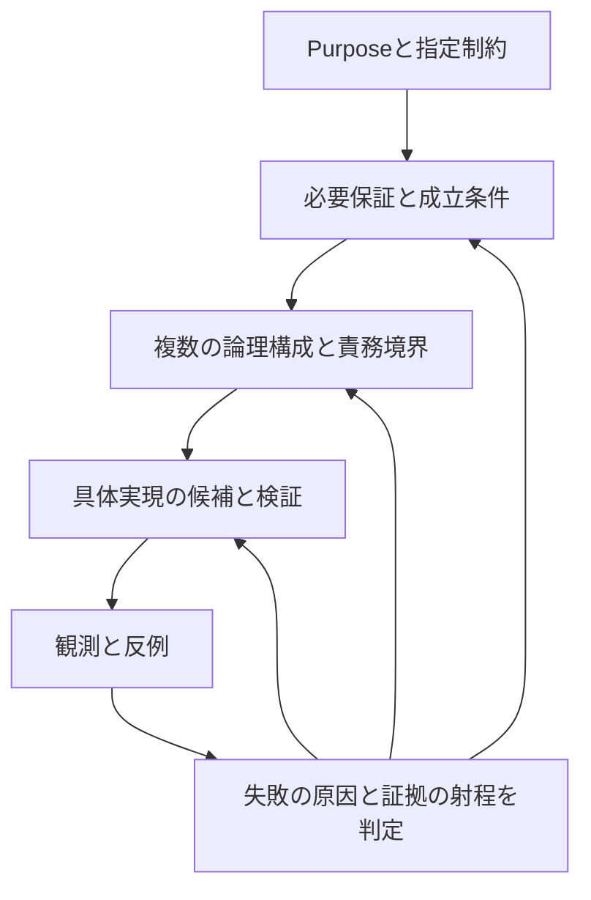

# AKR: 上流の理論・論理構成・下流への契約の統合

2026-10-02 JST · analysis draft · Architecture / format / schemaの採用決定ではない

## 0. 結論と差分

**上流と下流を分ける原則は既にある。今回具体化するのは、必要保証を候補ごとの責務と境界へ割り付け、その実現と反例を上流へ戻す経路である。**

Purpose / Absolute Principles / Hard Constraints、D01〜D49、F1〜F8、R0〜R7を引き継ぐ。49次元へのmapping、外部事例の数、小比較の成功を、上流理論の完成や探索closureの根拠にしない。今回の成果は既存分析に基づく論理推論であり、新しい実測・外部契約・普遍的な定理ではない。

追加するもの:

1. 前提、導出、候補依存の仮定、未知を区別する上流判断表。
2. 共通意味の範囲、採用authority、変更吸収を結合した、少数の論理構成案。
3. 同じscenarioにおける保証の成立箇所・失敗・変更波及の比較。
4. 下流へ渡す契約と、観測が上流を変える条件。

最終Architecture、Canonical format、DB、IR、schema、製品、容量別配置、数値閾値は決めない。今回例示する三構成は、設計空間の網羅や順位を表さない。

## 1. 基準と有効な前提

基準head: `8b4c33c556f48165d2074f846c7cdbb73ced6863`、draft PR #1。

- [Coverage Audit](./2026-09-29-architecture-search-space-coverage-audit.md): 次元、結合、F1〜F8、Interface経路、長期保守評価。
- [External / Assumption Delta](./2026-09-30-external-landscape-assumption-delta-audit.md): D48/D49、platform観測、CAC。
- [研究境界と情報価値](./2026-09-30-research-frontier-and-evidence-value-assessment.md): 証拠の非対称性、Familyの非排他性、同条件比較。
- [盲点総括](./2026-10-01-blindspot-synthesis-and-research-meta-analysis.md): 資産の増分便益、管理機構の自己改修、全体保証、研究過程の限定。
- [AI-native・規模・層への実現粒度](./2026-10-02-ai-native-scale-and-layer-realization-delta.md): 容量profile、配置とauthority、責務分割と資産粒度、方法論と互換性。
- [実運用評価](./2026-09-29-production-driven-architecture-evaluation.md): ARCH-A/B/C、四種類の候補、初稿の共通Canonical/JSON推奨を候補へ戻した経緯。

今回の別担当による推論記録:

- [上流判断と下流保証の整理](./upstream-contract-review-2026-10-02.md): 10論点の追加仮定・反例・未知。
- [反例・境界検査](./upstream-boundary-counterexamples-2026-10-02.md): 三段階の診断、五scenario、交差配置。

担当は問いと基準資料を共有している。別担当のレビューによる不確実性低減と、独立した実証を区別する。最終的な責務配置と差分の判断は統合担当が行う。

AIが主要な利用者・保守者であり、人間の日常的な整理・手編集を主前提にしない。AI-nativeは、全処理をmodelの推論だけで行う要件ではない。決定的な操作や検査をtoolへ委任する構成も、AIによる運用の候補として比較する。

GitHubは履歴・version・branch・rollbackの管理基盤という指定制約である。全payloadのGit内保管、単一writer、特定serialization、特定意味モデルはそこから導かない。

Google Driveの旧環境との並存はユーザー報告であり、実容量・authority・同期結果は未確認。「パーソナル型」の互換対象範囲も未確定のまま候補に残す。

## 2. 分離するのは研究上の判断段階

| 段階 | 問い | 出力 | この段階で確定しないもの |
|---|---|---|---|
| 上流 | 何を道具として管理し、何を維持・保証し、何を成功とするか。どの条件・不確実性があるか | 意味上の要求、保証範囲、評価目的、対立仮説 | universalな意味モデル、実装からの最適性 |
| 論理Architecture | 必要保証をどの責務・authority・境界・相互作用で成立させるか | 候補ごとの受理、取得、実行、改修、復旧の責務配置 | 一責務一service、固定された物理層数 |
| 具体実現 | どの表現・store・tool・protocol・harness・runtimeが契約を満たすか | 実装候補、実験、保証と費用の観測 | 局所成功からの上流一般化 |

三段階はAKRを三層のsoftwareへ分割する決定ではない。たとえば実行意味、適用判定、権限は複数段階に現れる。同じ論点の「何を守るか」「どこで守るか」「どう守り測るか」を区別する。

下流の失敗は上流へ戻せる。一方、現connectorで操作が公開されていないこと、Git mergeが通ったこと、あるDBが一条件で速かったことを、そのまま上流の意味や最適構成へ置き換えない。

### 2.1 推論の根拠を区別する

本文では、次の区別を研究上の注記として使う。AKRの必須schemaではない。

- **指定前提:** ユーザーのPurpose / Principles / Constraints。
- **導出:** 指定前提を満たすために必要な能力・保証。適用する操作とscopeを明示する。
- **設計仮説:** 特定の責務配置・意味モデル・保証方法を選ぶ理由。反証・変更可能。
- **観測:** 固定資料、外部契約、Issue報告、こちらの実行、ユーザー報告を別々に扱う。
- **未知:** 意味の判定、利用分布、保証の成立、費用等で、根拠が不足しているもの。

「形式化している」「AIが説明できる」「複数担当が一致した」は、それぞれ意味の真偽・有用性・実運用保証の独立実証を与えない。

## 3. 上流の判断表

以下は共通schemaのfield一覧ではない。重要な選択を、必要保証と候補依存の判断に分けるための表である。必要な情報は関連資料や解釈契約への固定参照で保持する候補も許す。

| 論点・根拠 | 上流から必要なこと | 残る対立仮説 | 反例と下流へ渡す範囲 |
|---|---|---|---|
| 対象と境界: Purpose、D02/03 | 再利用対象と、その改修・評価・取得単位を特定できる。登録時に完全分類を要求しない | 完結手順／primitive／制約／generator／評価器。単位を一致／分離 | 一つの手順を分割しただけで停止・責任が消える。下流は対象種類と必要保証を保持し、表現不能を明示 |
| 同一性と意味変更: version管理、D04/15/17 | 系統、固定内容、意味についての主張を区別し、更新・分岐を追える | 意味版を共通に定める／scopeごとの意味・対応主張を持つ | 同じID/hashや同じ例の出力だけで同値と扱う。下流は同一性の根拠と主張範囲を保持し、未判定を上書きしない |
| 解釈と未知: Explicit semantics、D06/07 | 重要な意味を再推測へ全面依存させず、どの規範・解釈・未知を扱うか特定する | 共通意味契約／native契約／限定領域の混成 | 未知や例外が簡略化で消える。下流は機械化範囲、未形式化部分、非対応を区別 |
| 適用と選択: 再利用、D08/30 | 何に、どの条件・証拠・能力で適用するかを判断できる | 明示条件中心／probe／経験的評価／AI判断 | 類似度が高いが前提違反。下流へは適用根拠、未確認条件、no-match、判断権限を渡す |
| 合成と実行: 組合せ、D09〜12 | 接続後の条件・作用・状態・停止・失敗を必要scopeで確認できる | 共通型・作用体系／個別契約と接続検査／生成後検証 | 単体合格でも作用順序が衝突。下流は実行・合成scopeと未検査箇所を示す。万能な自動合成器は導出されない |
| 採用とauthority: 複数AI、D05/20/40/44/47 | どの判断・版・scopeが利用状態を変えるか、競合をどう認識するか特定できる | 共通受理／用途別受理／共同規範。authorityとwriter数は別 | 旧環境で採用済みを全用途の許可へ拡張。下流は効力範囲・時間・変更条件を保持 |
| AIによる管理規則の改修: 継続保守、D32/33/37 | asset、checker、採否規則の変更と根拠を追い、検査契約が扱える範囲のregressionと、判定不能な範囲を区別できるようにする | 別段階の受理／同時提案＋独立根拠／用途別並行判断 | 新checkerだけで自分の変更を合格にする。旧新の判断対象・基準・差分と根拠を渡す。旧基準の永久固定は要求しない |
| 規模と配置: Scale、D23〜31/42/43/49 | 全資産投入に依存せず、必要集合を取得でき、失敗・修復範囲を追える | 集中／分割／連邦、事前生成／要求時生成 | 小さい本文でも依存閉包・変更波及が全体へ拡大。下流はbytes以外の負荷と、取得不能・未完了を示す |
| 交換と長期変化: Model/Environment independence、Evolution、D13/14/27/33/41/46 | 何が維持され、何が変わり、何が利用不能になるかを扱える | 安定した上位契約＋adapter／native保持＋対応管理／領域別契約 | model交換のために禁止条件を消す。下流は適応と意味変更を区別。全環境で同品質という保証は導出されない |
| 有用性と保守費: Purpose、Maintainability、D37/42 | 発見・再利用の便益と継続保守の費用を、利用条件と結び付けて評価する | 常時準備／必要時生成／用途別保持・置換 | 意味は保存したが利用価値がない、修復量が便益を超える。下流は品質・資源・未完了・更新範囲を返す。単一重みやwinnerは未決定 |

### 3.1 区別を維持する四つの判断

1. **意味を保存できたか:** 何の意味・範囲でそう主張するか。
2. **課題に有用だったか:** 資産を利用しない対照を含む品質・費用の差。
3. **この用途で採用してよいか:** authority、効力、権限、必要証拠。
4. **維持し続ける価値があるか:** 将来利用の不確実性、保守・保存・再生成費。

これらは同じ判定ではない。経験的な結果一致は全意味同値ではなく、利用価値の低下は全用途の廃止ではない。AIが主要保守者でも、自動的にすべての規範・用途を一つへ集約できるとは仮定しない。

## 4. 多角的推論から生じる結合問題

| 視点 | 他の選択と結合すると生じる問い | 次元へ戻す位置 |
|---|---|---|
| 意味・認識 | 自然言語、形式化、未知を共存させて合成・queryの保証範囲をどう保つか | D02/06〜10/29/32 |
| 計算・利用 | 生成した方法、発見した方法、保存した方法を、何の品質と費用で比較するか | D11/13/14/30/37/42/46 |
| AIの統治・自己改修 | 検査・採用規則も変化する中で、変更の受理が循環した自己認証にならないか | D05/18/32/33/37/40/44 |
| 分散・情報配置 | 保存、取得、受理、実行の版と時間が違うとき、何を一貫させるか | D15/20/21/25/31/43/47/49 |
| 時間・進化 | 下位交換だけで吸収できる変更と、意味契約やlayer境界を変える変更をどう分けるか | D13/14/33/35/41/45/46、CAC |
| 費用・利用分布 | 対応範囲を広げる便益が、対応管理・検査・旧版維持の費用を上回る条件は何か | D03/17/37/42/44、R0/R7 |

個別には良い性質でも、結合すると費用や保証が変わる。例えば広いnative保持は表現損失を減らす候補だが、領域をまたぐquery・適用・合成を、共通意味モデルと同じ保証で実施できるとは限らない。共通意味モデルも、保証の共有を可能にする範囲がある一方、対象を既存語彙へ押し込める可能性がある。

実行形式の統一、採用規則の統一、意味モデルの統一、保存場所の統一を一つの選択にまとめない。これらを分離したまま、結合する責務を検査する。

### 4.1 成立条件を使った四つの推論

次は置いた条件からの論理推論である。実装性能の観測や、全領域へ適用する新しい定理ではない。

1. **局所検査だけでは、非局所の不変条件を一般には保証できない。** A→BとB→Aを別々の主体が追加し、各局所集合にはcycleがないが、利用集合にはcycleができる場合を置く。その集合でcycleを禁止するなら、両変更を共同で検査するか、操作を制限するか、共同利用を検査まで保留する必要がある。個別受理の成功を全体保証へ拡張する案は、この条件では成立しない。調整が必要なのは当該不変条件・操作の範囲であり、全操作の集中化は導かない。

2. **新情報を受け取れない主体には、未知の撤回を識別できない。** 同じ旧contextを持つoffline主体から見て、撤回が起きた世界と起きていない世界が区別不能な条件を置く。接続確認なしの継続を許しながら、発生した全撤回へ直ちに従うという保証は置けない。期限・再確認・許す作用・停止範囲・効力時点のどこかを定める必要がある。中央authorityもevent-driven activationも、この情報条件を自動的に解消しない。

3. **表現できない重要な意味を捨てた変換は、同じ意味の適応とは呼べない。** 対話条件や未知が入力にはあるが出力契約には存在せず、補助資料にも残らない条件を置く。意味契約を拡張する、native規範を併存させる、当該scopeの対応を拒否/保留する、意図した意味変更として別に評価する、という候補が必要になる。未知fieldのbytes保持だけでは、その意味が実際の判断へ届く保証にはならない。

4. **新しい判定基準への適合だけでは、旧意味の保存や基準変更の正当性は示せない。** assetとchecker/採否規則を同時に変えた条件を置く。新checkerの合格が示す範囲は、新基準の実装と検査能力に依存する。旧新の判断差、変更理由、規範変更を受理するscope/authorityを別に追う必要がある。旧checkerの永久固定や全変更の人間承認は、この推論からは導かない。

この四点は、ある製品を採用する理由ではなく、候補が明示すべき成立条件を制約する。要求の両立条件を上流で置くことで、下流の部品機能を足し合わせただけの保証を避ける。

## 5. 少数の論理構成へ展開する

### 5.1 独立な選択を先に確認する

| 意味の構成 | 共通の受理境界を持つ | 用途・領域ごとの受理境界を持つ |
|---|---|---|
| 広い共通契約 | 共通契約で検査する協調受理 | 共通契約を使う複数authority。契約一致だけでは採用判断は一致しない |
| nativeな意味契約 | native契約と対応証拠を共通の採用判断へ結ぶ | native契約と用途別採用を結び、横断利用時の接続保証を扱う |

したがって共通意味の広さとauthorityの集中度は独立に検討する。共通の受理境界は、人間の承認、一つのwriter、一つのDB、一つのserverを意味しない。個人用でも複数AI・用途・旧新環境が並存し得る。

以下のL1〜L3は、既存D/Fから責務を結合した比較用構成である。ARCH-A/B/Cの代替命名やF9〜F11ではない。既存候補との重複を認めたうえで、保証成立箇所と反例を追加する。三案以外の組合せも残す。

### 5.2 責務と保証の位置

| 責務 | L1: 広い共通意味契約で受理 | L2: native意味と用途別採用で接続 | L3: 共通管理と領域別意味契約 |
|---|---|---|---|
| 規範と意味 | 宣言した対象領域を共通契約で扱い、固定資料・解釈から意味を定める | 各候補の固定native資料・解釈と、範囲付き対応主張を保持 | 管理上の共通契約と、領域ごとの意味契約・変換条件を保持 |
| Capture | 未変換の原資料も保存。共通契約へ適合していない状態を示す | nativeのまま候補化し、対応不能・未知を保存 | 共通管理へ登録し、未分類/未形式化/領域別の扱いを示す |
| 更新・受理 | 指定scopeの協調受理で基準版・必要不変条件・意味差分を検査 | 各scopeが自分の意味・採用条件で受理。横断保証は別に確認 | 領域内で検査・受理。領域をまたぐ変更は指定した連携境界で確認 |
| 採用authority | 共通受理の採用規則をscopeごとに特定 | 用途別規則とその変更根拠を特定。局所採用から全用途許可を導かない | 共通管理の受理と領域/用途の意味採用を区別 |
| 発見・query | 共通契約の判定可能範囲をqueryへ公開 | 各native queryと、限定した投影・対応主張を接続 | 共通管理queryと領域内semantic queryを接続 |
| 合成・実行 | 共通条件・作用・停止の範囲で合成し、runtimeへ適応 | 各契約と接続条件を、固定した利用planで確認。未対応を明示 | 領域内の共通規則と、領域間の変換・作用・状態契約を確認 |
| Working context | 受理集合、採用scope、解釈、必要依存をtaskへbinding | native資料、対応証拠、用途別採用、横断planをbinding | 共通管理版、領域契約、変換器、採用、依存をbinding |
| 管理機構の変更 | 共通契約/checkerの変更影響と旧新判断を検査 | 各native契約・関係・採用規則の変更と、横断影響を検査 | 共通管理と領域契約の変更を別々に追い、境界の変更も検査 |
| 保持・復旧 | 資料集合、解釈、受理根拠、採用集合、生成条件を復元 | native資料、解釈、対応/採用判断、接続条件を復元 | 共通管理、領域契約、対応条件、採用判断を復元 |
| GitHubとの対応 | 固定commitが提案・採用状態と外部内容・解釈を特定 | scopeごとの固定参照・対応・採用判断を履歴へ結ぶ | 共通/領域/境界の変更と固定内容を履歴へ結ぶ |

Capture・意味採用・利用開始は同じ操作ではない。各案とも、保存しただけで実行可能とは扱わない。index、event log、DB、object graph、workflow、IR等は各案の実現候補であり、この表から特定の採用は導かない。

### 5.3 各案の成立条件と失敗

| 構成 | 利点が生じる仮説 | 必要な成立条件 | 意味・保証を失う条件 | 費用が集中する場所 |
|---|---|---|---|---|
| L1 | 共通の適用・変更・合成検査を繰り返し使える便益が大きい | 重要な対象意味を契約で扱えるか、未対応を保持できる。共通契約変更の影響を追える | 表現できない例外を落とす、全scopeへ同じ採用を強制する | 共通化、移行、契約の拡張と再検査 |
| L2 | nativeの多様性・独立改修の便益が大きい | 局所保証と横断保証を区別し、必要な接続条件を確認できる | 局所採用・類似・同じIDを横断同値へ拡張する | 対応、横断query/合成、重複検査、scope別改修 |
| L3 | 領域内の共有と、領域間の意味保持が両立する | 領域の分割理由と境界を扱え、共通契約を肥大化させず境界変更を追える | 境界へ入らない対象を誤分類、領域横断の保証を誰も担当しない | 領域分割、境界契約、共通/固有契約の共同移行 |

L3が常に妥協案として優れるとは言えない。単純な対象では境界管理が余計な費用となり得る。L2の局所受理は、調整が不要という主張でもない。L1は全将来対象の普遍的表現を保証しない。

L2/L3の共通管理にも、identity、版、対応主張、採用scope等の意味がある。中立で移行不要な固定点とは扱わず、その契約、変更authority、旧reader、native/domainとの境界を保守対象に含める。どこまで共通にするかは未選定である。

## 6. 同じscenarioで論理的に比較する

以下は設計上の反例・思考実験であり、新しい運用結果ではない。各案へ同じ意味モデルを強制せず、同じ原資料・要求・必要保証を渡す。

### S1: 複数AIが局所改修し、接続後に禁止された状態が生じる

条件: AとBの単体検査は通るが、合成後の作用順序または依存cycleが利用条件に違反する。保存内容のmergeは成功したと仮定する。

- **上流保証:** 必要scopeで接続後の不変条件違反を検出し、受理・利用・未判定を区別する。
- **L1:** 共通受理集合と共通契約の検査範囲で検出する。必要な作用・依存が共通契約から欠落していれば、同受理の成功だけでは保証できない。
- **L2:** 局所版は保持できる。横断採用または実行planで接続条件を確認する。その確認を省けば、局所保証だけでは成立しない。
- **L3:** 領域内なら領域検査、領域間なら指定した境界検査が担当する。変更が複数領域へ届く影響計算を欠くと漏れる。
- **下流への課題:** stale基準、同時受理、別readerで同じ違反を検出できるか。Git merge成功は保証の代用にしない。

### S2: algorithmとchecker・採用規則が同時に変わる

条件: 新checkerが新assetを合格にするが、旧判断の前提または利用条件が消える。

- **上流保証:** assetの意味変更と評価/採用規則変更を識別し、旧新の判断対象・根拠・差を追える。旧規則を永久に正しいとする要求ではない。
- **L1:** 共通契約/checker改修の対象scopeと再検査範囲を確認。共通化しても自己認証問題は消えない。
- **L2:** 各scopeの判断変更を保持し、対応・横断採用に及ぶ差を確認。scope数が増えるほど共同判定費が増える可能性がある。
- **L3:** 共通管理、領域意味、境界検査のどれが変わるかを別に追う。全領域が同時に変わる場合の受理責務も必要。
- **下流への課題:** 旧新の基準と反例を固定し、変更理由・適用scope・未判定を復元できるか。同じmodelの説明だけを独立した意味oracleとは扱わない。

### S3: 旧環境・offline context・利用停止が並存する

条件: 固定した旧bundleと継続中jobがある。別scopeでは利用停止が採用され、効力発生時刻がある。通信断で最新状態を取得できない。

- **上流で先に選ぶこと:** 旧版で限定利用できる条件、失効確認が必要な操作、鮮度不足時の停止/保留、実行中instanceへの効力。全用途に同じ即時停止を要求しない。
- **L1:** 共通採用規則の固定版と鮮度条件をcontextへ渡す。中央の最新状態があるだけではoffline主体へ伝わらない。
- **L2:** scopeごとの採用をbindingし、横断利用に必要な最新性を確認。別scopeの停止が自分へ及ぶかを明示する。
- **L3:** 領域・用途の採用と境界利用条件をbindingする。共通管理の更新を、意味上の全利用停止と混同しない。
- **下流への課題:** record時刻と効力時刻、context固定版と現在許可、内容復元と外部作用の補償を分ける。event通知だけで失効保証を完了としない。

### S4: 同じ容量でも資産・関係・更新負荷が異なる

条件: 少数の大きな不変payloadと、多数の小資産・密な依存・連続更新を対照にする。数百GB/TB/PBは仮想負荷条件であり、現在量ではない。

- **上流保証:** 全資産のcontext投入を前提にせず、必要な内容・依存・判断根拠を特定し、費用と未完了を観測できる。
- **L1:** 共通query/検査の便益と、共通契約更新時の再検査閉包を比較する。
- **L2:** nativeな部分取得の便益と、横断query・関係判断・失効伝播の負荷を比較する。
- **L3:** 領域内の増分処理の便益と、境界をまたぐ変更・再分類の負荷を比較する。
- **下流への課題:** bytes、object/edge数、active集合、取得集合、変更閉包、queue、転送/復元量を分けて測る。小例でPB性能を実証したとは扱わない。

### S5: model/harness/runtimeが変わり、能力が上昇または制限される

条件: より高能力の環境では補助構造が不要になる一方、local/limited-tool環境では一部操作を実現できない。

- **上流保証:** 維持した意味・identity・lineageと、変わった実行方式・品質・対応範囲を区別する。
- **L1:** 共通契約から別profileへ適応する。共通契約が現harnessの手順を規範化していれば波及は上流へ届く。
- **L2:** native実行の選択肢を使うが、対応主張と用途別評価を更新する。古い最適profileを意味全体の最適としない。
- **L3:** 領域契約内のloweringと、境界の能力要件を更新する。必要なら領域分割自体の変更を検討する。
- **下流への課題:** Backend × Representation × Tool exposure × Protocol × Permissions × Harness × Working Context × Execution Environmentの実経路を記録。高能力でも必要保証が消えるとは仮定しない。

S1〜S5の違いを説明できることは、理論上の比較可能性である。実際の意味判定能力・低費用・長期有用性の証明ではない。

## 7. 下流へ渡す契約

研究上の契約は、必須APIやrecord schemaではない。候補ごとに、少なくとも次を説明できる状態にする。

1. **対象・操作・scope:** 保存、変更、採用、合成、実行、復旧のどれを保証するか。
2. **意味の根拠:** 固定内容、解釈、条件、重要な未知と非対応。
3. **版・authority・時間:** どの判断が効力を持ち、どの時点・用途へ適用するか。
4. **成立条件:** 必要な依存、権限、能力、接続、保持実体。
5. **成功・失敗・未判定:** 判定方法と根拠の射程。失敗時に何が保持されるか。
6. **責務の所在:** どこで確認し、どこが変更・再試行・修復を担当するか。
7. **変更と復旧:** 何を交換でき、何の意味再評価・移行が必要か。復元できない範囲。
8. **費用と観測:** 取得、生成、検査、維持、未完了の何を測るか。

固定参照やdigestは必要な内容の特定に使えるが、実体・reader・解釈・許可を復元する保証とは別である。GitHubと外部storeの原子的同時更新を仮定せず、提案・受理・反映・公開のどの段階で利用可能になるかを候補ごとに定める。

### 7.1 上流を見直す条件

| 観測された失敗 | 最初に検討する箇所 | 上流へ戻す条件 |
|---|---|---|
| connectorに必要な操作がない、返却が欠落する | 具体実現、別tool、batch、取得経路 | 他経路でも必要な情報・作用を実現できず、要求や能力仮定の変更が必要 |
| 個々のcomponentは契約を満たすが接続後に保証が切れる | 論理構成の責務・境界・binding | 必要scope/時間/意味が上流で定義されていない、または両立不能な保証を要求していた |
| 変換で重要な意味が失われる | converter、意味対応、契約範囲。候補モデルに表現不足があれば論理構成の仮説を見直す | 対象理解の不足、意味定義の矛盾、必要保証の両立不能等が別途示された場合。特定モデルの不足だけで上流の対象・保証を縮めない |
| 不変条件は守るが利用価値がない | task、発見/提示、profile、評価 | 何を有用な道具とするか、保持/再生成・用途分布の仮定が変わる |
| 改修・修復・旧版維持が過大 | 増分処理、境界、生成/保持方針 | 共通化・互換範囲・粒度の仮定が費用を構造的に増やしている |

分類は根本原因の自動判定規則ではない。同じ症状が複数原因から生じる場合は、代案、証拠、不明点を残す。一つの実装の失敗から必要保証の不可能性を推定せず、説明だけからその可能性を実証済みとも扱わない。

## 8. D/F/Rへの差分

### 8.1 Design Dimension / Family

D01〜D49を維持する。新しい次元を必要とする反例は今回確認していないが、地図が完全であるという判断ではない。

- D03のasset粒度と、D05/06/14/18/21/23/32/38/43/46/49にまたがる責務分割を分けた。
- D05のauthority、D06の意味契約、D20/21の受理・整合性、D40の権限を、同じ選択として扱わない。
- D48は仕事の起動・受入条件、D49はtaskの版・根拠・依存のbindingを担う。起動event自身が意味採用や失効確認を完了するとは扱わない。

F1〜F8を維持する。L1〜L3へ一対一対応させず、F1/7は固定内容・生成・公開、F2/3は受理と履歴、F4はnative/対応/用途別採用、F5/8は生成・意味変換、F6は状態・作用・継続の責務を実現する候補として対応付ける。どのFも、それ単独でS1〜S5を満たすとは推定しない。

### 8.2 Interface / CAC

Interface Capacityは、特定の権限・予算・操作経路の下で、必要保証を保って到達可能な課題範囲という既存定義を維持する。公開操作・情報・保証はその成立を評価する要素であり、仕様上の能力、公開済みの能力、到達を実証した能力、未確認を区別する。Realization Efficiencyも既存の品質・費用・成功/失敗/未判定の条件付き評価を維持し、特定modelと構成がその範囲を実際にどこまで実現したかを観測する。backendの容量やtransaction能力を、AIの実現能力と同一視しない。

Change Absorption Capacityは、交換後に保持できた意味・identity・lineage・判断根拠と、変更・再検査・移行が及ぶ範囲で評価する。安定した契約が多い案が常に優れるとは限らない。契約自体が現在の制約を固定していれば、将来の能力を使う変更の費用を増やし得る。

### 8.3 Research Priority

R0〜R7の名称と既存対照を維持する。今回、実験へ渡す前提の具体化を優先する。全研究の数値順位は付けない。

| 研究 | 今回の追加 | 次に必要な証拠 |
|---|---|---|
| R0 | 自然な原資料と利用要求を、判断表・L案のscopeへ結ぶ | 対象種類、利用条件、資産利用の増分便益 |
| R1 | 受理・公開・意味採用の境界を候補ごとに明示 | S1、Git/外部store部分成功、拒否時の保持 |
| R2 | 同じ対象を異なる資産粒度と責務分割で扱う | 作用・停止・合成、変更・再検査閉包 |
| R3 | 定義版・採用状態・実行instanceの継続条件を分離 | S3の中断/旧job/作用/取消・補償 |
| R4 | 共通/native/領域別の意味・authority仮説を同条件で比較 | S1/S2の対応不能、未知、旧新判断 |
| R5 | taskへ何をbindingし、何を現在確認するかを具体化 | S3/S4の鮮度、offline、変更波及、取得量 |
| R6 | 管理機構とlayer境界の変更を移行対象に含める | S2/S5、旧資料・reader・判断理由の復元 |
| R7 | 共通queryとnative query、適応と意味変更を区別 | S5の品質・予算・実経路、再利用/再生成対照 |

外部探索は、必要保証や対応方法が具体的な境界で未設計となった際に絞って行う。今回の推論だけで外部研究が不要になったとは判断しない。

## 9. 一巡の到達点と残る未知

今回の上流統合の一巡は、主要な選択について、必要保証・候補依存の仮定・責務・反例・下流の必要証拠を説明できる状態にすることで区切る。追加案が既存案と異なる成立条件・保証・変更波及を持つなら残す。同じ案の別名や、個別製品の機能数だけでは選択肢が増えたと数えない。

この停止条件は、Purposeから問い自体を見直す探索を排除しない。新しい対象・利用・故障から、既存判断表が表せない要求が出れば、その問いから再開する。開始前に既存案のwinnerへ結び付けることは要求しない。

残る未知:

- 現asset群以外の意味・合成の多様性と、どの共通契約が実際に表現できるか。
- 自然言語意味についての独立判定、経験的同等性と意味同値の扱い。
- 用途間の採用競合、効力、offline許容、実行中instanceへの変更条件。
- 広い個人互換とlayer適合の便益、AI生成adapterの全維持費。
- 数百GB/TB/PBの実負荷、object・依存・更新・復元の限界。
- 管理規則の変更を評価する独立根拠と、境界変更を伴う移行費。
- 将来のmodel/harness能力、利用分布、保持と必要時生成の長期trade-off。

**上流理論は、下流から隔離して完成させる対象ではない。必要保証と意味の判断を下流の都合へ従属させず、具体的な反例によって前提・論理構成・実現を区別して更新する。** 今回はその引継ぎを具体化した。三案の勝者、普遍的な理論、全互換、最終方式は未決定である。
